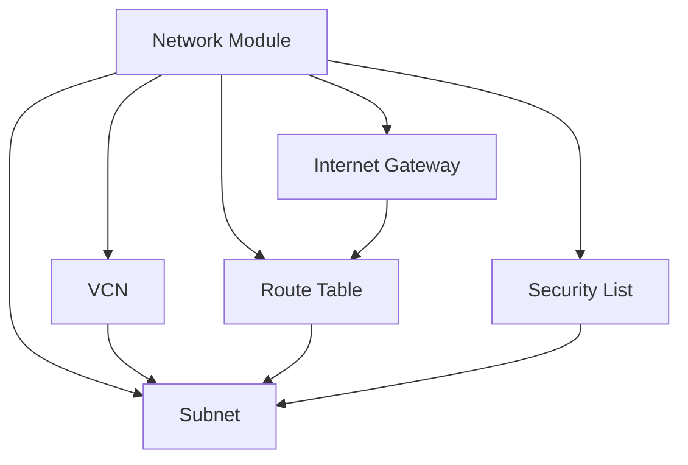
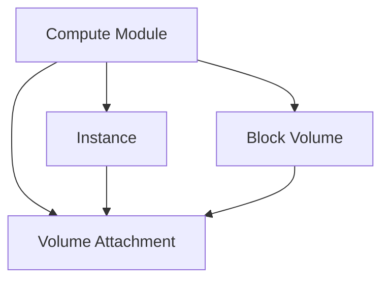

# Terraformのモジュール化アプローチ

このドキュメントでは、Terraformコードをモジュール化するメリットと、このプロジェクトでのモジュール構造について説明します。

## 目次

1. [モジュール化のメリット](#モジュール化のメリット)
2. [プロジェクト構造](#プロジェクト構造)
3. [モジュールの設計](#モジュールの設計)
4. [モジュールの使用方法](#モジュールの使用方法)
5. [環境ごとの設定](#環境ごとの設定)

## モジュール化のメリット

Terraformコードをモジュール化することで、以下のメリットが得られます：

1. **再利用性**: 同じコードを複数の場所で再利用できる
2. **保守性**: 変更が必要な場合、一箇所を修正するだけで済む
3. **抽象化**: 複雑な実装の詳細を隠蔽し、シンプルなインターフェースを提供
4. **テスト容易性**: モジュール単位でテストが可能
5. **バージョン管理**: モジュールごとにバージョンを管理できる

## プロジェクト構造

このプロジェクトでは、以下のようなディレクトリ構造を採用しています：

```
oci-terraform-handson/
├── modules/                # 再利用可能なモジュール
│   ├── network/            # ネットワークリソース用モジュール
│   │   ├── main.tf
│   │   ├── variables.tf
│   │   └── outputs.tf
│   └── compute/            # コンピュートリソース用モジュール
│       ├── main.tf
│       ├── variables.tf
│       └── outputs.tf
├── environments/           # 環境ごとの設定
│   └── dev/                # 開発環境
│       ├── main.tf
│       ├── variables.tf
│       ├── outputs.tf
│       └── terraform.tfvars.example
└── docs/                   # ドキュメント
```

この構造の特徴：

- **modules/**: 再利用可能なコンポーネントを格納
- **environments/**: 各環境（開発、テスト、本番など）固有の設定を格納
- **docs/**: プロジェクトのドキュメントを格納

## モジュールの設計

### ネットワークモジュール

ネットワークモジュール（`modules/network/`）は、以下のリソースを管理します：

- 仮想クラウドネットワーク (VCN)
- サブネット
- インターネットゲートウェイ
- ルートテーブル
- セキュリティリスト



### コンピュートモジュール

コンピュートモジュール（`modules/compute/`）は、以下のリソースを管理します：

- コンピュートインスタンス
- ブロックボリューム
- ボリュームアタッチメント



## モジュールの使用方法

モジュールは、`module`ブロックを使用して呼び出します：

```hcl
module "network" {
  source = "../../modules/network"

  compartment_id     = oci_identity_compartment.tf_compartment.id
  vcn_cidr           = "10.0.0.0/16"
  vcn_name           = "DevVCN"
  vcn_dns_label      = "devvcn"
  public_subnet_cidr = "10.0.1.0/24"
}
```

モジュールの呼び出しには、以下の要素があります：

- **source**: モジュールのパス（ローカルパスまたはリモートURL）
- **入力変数**: モジュールに渡す変数（上記の例では`compartment_id`など）

モジュールの出力値は、以下のように参照できます：

```hcl
module.network.subnet_id
```

## 環境ごとの設定

このプロジェクトでは、環境ごとに異なる設定を`environments/`ディレクトリに格納しています。

### 開発環境（dev）

開発環境の設定は`environments/dev/`ディレクトリにあります：

```hcl
# ネットワークモジュールの呼び出し
module "network" {
  source = "../../modules/network"

  compartment_id     = oci_identity_compartment.tf_compartment.id
  vcn_cidr           = "10.0.0.0/16"
  vcn_name           = "DevVCN"
  vcn_dns_label      = "devvcn"
  public_subnet_cidr = "10.0.1.0/24"
}

# コンピュートモジュールの呼び出し
module "compute" {
  source = "../../modules/compute"

  compartment_id         = oci_identity_compartment.tf_compartment.id
  availability_domain    = data.oci_identity_availability_domain.ad.name
  subnet_id              = module.network.subnet_id
  image_id               = data.oci_core_images.oracle_linux.images[0].id
  instance_name          = "DevInstance"
  ocpus                  = 4
  memory_in_gbs          = 24
  ssh_public_key         = var.ssh_public_key
  block_volume_size_in_gbs = 100
}
```

### 環境ごとの使い分け

各環境ディレクトリで`terraform`コマンドを実行することで、その環境に特化したインフラを管理できます：

```bash
# 開発環境のデプロイ
cd environments/dev
terraform init
terraform apply

# 本番環境のデプロイ（本番環境ディレクトリがある場合）
cd environments/prod
terraform init
terraform apply
```

## モジュール化のベストプラクティス

1. **単一責任の原則**: 各モジュールは一つの責任を持つべき
2. **入力変数のバリデーション**: 入力値の検証を行い、エラーを早期に検出
3. **デフォルト値の提供**: 可能な限りデフォルト値を設定し、使いやすさを向上
4. **適切な粒度**: 大きすぎず、小さすぎないモジュールサイズを選択
5. **ドキュメント化**: 各モジュールの目的、入力、出力を明確に文書化

```hcl
# 入力変数のバリデーション例
variable "ocpus" {
  description = "OCPUの数"
  type        = number
  default     = 4
  
  validation {
    condition     = var.ocpus <= 4
    error_message = "OCPUの数はAlways Free枠では最大4です。"
  }
}
```

---

モジュール化されたTerraformコードは、インフラの管理を効率化し、エラーを減らすのに役立ちます。このプロジェクトのモジュール構造を参考に、独自のTerraformプロジェクトを設計してみてください。