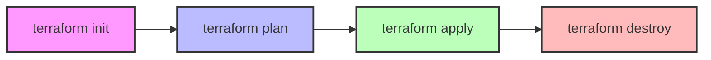

# Terraformコード詳細解説

このドキュメントでは、OCI Free Tierハンズオンで使用するTerraformコードの詳細を解説します。Terraform初心者でも理解できるよう、コードの各部分を詳しく説明します。

## 目次

1. [Terraformの基本概念](#terraformの基本概念)
2. [プロジェクト構造](#プロジェクト構造)
3. [main.tf](#maintf)
4. [variables.tf](#variablestf)
5. [datasources.tf](#datasourcestf)
6. [outputs.tf](#outputstf)
7. [terraform.tfvars](#terraformtfvars)
8. [リソース間の依存関係](#リソース間の依存関係)
9. [ベストプラクティス](#ベストプラクティス)

## Terraformの基本概念

Terraformを理解するには、以下の基本概念を押さえておく必要があります：

### 宣言的構文

Terraformは**宣言的**なアプローチを採用しています。これは「どうやって作るか」ではなく「何を作りたいか」を記述するスタイルです。

```hcl
# 命令的（手続き的）アプローチ
1. VCNを作成する
2. サブネットを作成する
3. VCNとサブネットを関連付ける

# 宣言的アプローチ（Terraform）
resource "oci_core_vcn" "tf_vcn" {
  # VCNの属性を定義
}

resource "oci_core_subnet" "tf_subnet" {
  vcn_id = oci_core_vcn.tf_vcn.id
  # サブネットの属性を定義
}
```

### HCL (HashiCorp Configuration Language)

TerraformはHCLという独自の言語を使用します。HCLは読みやすく書きやすいように設計されています。

```hcl
# ブロック構造
<ブロックタイプ> "<リソースタイプ>" "<リソース名>" {
  <属性名> = <属性値>
}

# 例
resource "oci_core_vcn" "tf_vcn" {
  compartment_id = var.compartment_id
  cidr_blocks    = ["10.0.0.0/16"]
}
```

### Terraformの実行フロー

Terraformの基本的な実行フローは以下の通りです：



1. **terraform init** - プロジェクトの初期化、プロバイダのダウンロード
2. **terraform plan** - 実行計画の作成（何が作成/変更/削除されるか）
3. **terraform apply** - 実行計画の適用（実際のリソース作成）
4. **terraform destroy** - 作成したリソースの削除

## プロジェクト構造

```
oci-terraform-handson/
├── main.tf           # メインのTerraformコード
├── variables.tf      # 変数の定義
├── datasources.tf    # データソース（既存リソースの参照）
├── outputs.tf        # 出力値の定義
├── terraform.tfvars  # 変数の値（gitignoreに追加推奨）
└── docs/             # ドキュメント
```

ファイルを分割することで、コードの管理が容易になります。ただし、Terraformは実行時にディレクトリ内の`.tf`ファイルをすべて読み込むため、ファイル名は任意です。

## main.tf

`main.tf`は、プロジェクトのメインファイルで、作成するリソースを定義します。

### Terraform設定ブロック

```hcl
terraform {
  required_providers {
    oci = {
      source  = "oracle/oci"
      version = "~> 5.0"
    }
  }
  required_version = ">= 1.0.0"
}
```

- **required_providers** - 使用するプロバイダを指定
  - **source** - プロバイダのソース（`<組織>/<プロバイダ名>`）
  - **version** - プロバイダのバージョン制約
    - `~> 5.0` は 5.0.x の任意のバージョンを意味する
- **required_version** - 必要なTerraformのバージョン
  - `>= 1.0.0` は 1.0.0 以上のバージョンを意味する

### プロバイダー設定

```hcl
provider "oci" {
  tenancy_ocid     = var.tenancy_ocid
  user_ocid        = var.user_ocid
  fingerprint      = var.fingerprint
  private_key_path = var.private_key_path
  region           = var.region
}
```

- **provider "oci"** - OCIプロバイダの設定
  - **tenancy_ocid** - OCIテナンシーのOCID
  - **user_ocid** - OCIユーザーのOCID
  - **fingerprint** - APIキーのフィンガープリント
  - **private_key_path** - APIキーの秘密鍵のパス
  - **region** - OCIリージョン（例：ap-tokyo-1）

### コンパートメント

```hcl
resource "oci_identity_compartment" "tf_compartment" {
  name           = "terraform-compartment"
  description    = "Compartment for Terraform resources"
  compartment_id = var.tenancy_ocid
  
  enable_delete = true
}
```

- **resource** - リソースを定義するブロック
  - **"oci_identity_compartment"** - リソースタイプ
  - **"tf_compartment"** - リソース名（Terraform内での参照名）
- **name** - コンパートメントの名前
- **description** - コンパートメントの説明
- **compartment_id** - 親コンパートメントのID
  - ここではテナンシーのルートコンパートメントを指定
- **enable_delete** - Terraformによる削除を許可するフラグ
  - `true`にすると、`terraform destroy`でコンパートメントを削除できる

### 仮想クラウドネットワーク (VCN)

```hcl
resource "oci_core_vcn" "tf_vcn" {
  compartment_id = oci_identity_compartment.tf_compartment.id
  cidr_blocks    = ["10.0.0.0/16"]
  display_name   = "TerraformVCN"
  dns_label      = "tfvcn"
}
```

- **compartment_id** - VCNを作成するコンパートメントのID
  - `oci_identity_compartment.tf_compartment.id` は、先に定義したコンパートメントのIDを参照
- **cidr_blocks** - VCNのIPアドレス範囲
  - `10.0.0.0/16` は 10.0.0.0 から 10.0.255.255 までの範囲
- **display_name** - VCNの表示名
- **dns_label** - VCN内のDNS解決に使用するラベル
  - これにより、`<hostname>.tfvcn.oraclevcn.com` という形式のFQDNが生成される

### インターネットゲートウェイ

```hcl
resource "oci_core_internet_gateway" "tf_internet_gateway" {
  compartment_id = oci_identity_compartment.tf_compartment.id
  vcn_id         = oci_core_vcn.tf_vcn.id
  display_name   = "TerraformInternetGateway"
  enabled        = true
}
```

- **vcn_id** - インターネットゲートウェイを作成するVCNのID
- **enabled** - インターネットゲートウェイを有効にするフラグ

### ルートテーブル

```hcl
resource "oci_core_route_table" "tf_route_table" {
  compartment_id = oci_identity_compartment.tf_compartment.id
  vcn_id         = oci_core_vcn.tf_vcn.id
  display_name   = "TerraformRouteTable"

  route_rules {
    destination       = "0.0.0.0/0"
    destination_type  = "CIDR_BLOCK"
    network_entity_id = oci_core_internet_gateway.tf_internet_gateway.id
  }
}
```

- **route_rules** - ルートテーブルのルール
  - **destination** - 宛先IPアドレス範囲
    - `0.0.0.0/0` はすべてのIPアドレス（インターネット）を意味する
  - **destination_type** - 宛先のタイプ
    - `CIDR_BLOCK` はCIDR表記のIPアドレス範囲
  - **network_entity_id** - トラフィックの転送先エンティティのID
    - ここではインターネットゲートウェイのIDを指定

### サブネット

```hcl
resource "oci_core_subnet" "tf_public_subnet" {
  compartment_id             = oci_identity_compartment.tf_compartment.id
  vcn_id                     = oci_core_vcn.tf_vcn.id
  cidr_block                 = "10.0.1.0/24"
  display_name               = "TerraformPublicSubnet"
  dns_label                  = "public"
  route_table_id             = oci_core_route_table.tf_route_table.id
  security_list_ids          = [oci_core_security_list.tf_security_list.id]
  prohibit_public_ip_on_vnic = false
}
```

- **cidr_block** - サブネットのIPアドレス範囲
  - `10.0.1.0/24` は 10.0.1.0 から 10.0.1.255 までの範囲
- **dns_label** - サブネット内のDNS解決に使用するラベル
  - これにより、`<hostname>.public.tfvcn.oraclevcn.com` という形式のFQDNが生成される
- **route_table_id** - サブネットに関連付けるルートテーブルのID
- **security_list_ids** - サブネットに関連付けるセキュリティリストのIDのリスト
- **prohibit_public_ip_on_vnic** - パブリックIPの割り当てを禁止するフラグ
  - `false` にすると、サブネット内のインスタンスにパブリックIPを割り当て可能

### セキュリティリスト

```hcl
resource "oci_core_security_list" "tf_security_list" {
  compartment_id = oci_identity_compartment.tf_compartment.id
  vcn_id         = oci_core_vcn.tf_vcn.id
  display_name   = "TerraformSecurityList"

  # SSH接続用のインバウンドルール
  ingress_security_rules {
    protocol  = "6" # TCP
    source    = "0.0.0.0/0"
    stateless = false

    tcp_options {
      min = 22
      max = 22
    }
  }

  # HTTP接続用のインバウンドルール
  ingress_security_rules {
    protocol  = "6" # TCP
    source    = "0.0.0.0/0"
    stateless = false

    tcp_options {
      min = 80
      max = 80
    }
  }

  # HTTPS接続用のインバウンドルール
  ingress_security_rules {
    protocol  = "6" # TCP
    source    = "0.0.0.0/0"
    stateless = false

    tcp_options {
      min = 443
      max = 443
    }
  }

  # すべてのアウトバウンドトラフィックを許可
  egress_security_rules {
    protocol    = "all"
    destination = "0.0.0.0/0"
    stateless   = false
  }
}
```

- **ingress_security_rules** - インバウンド（受信）トラフィックのルール
  - **protocol** - プロトコル番号
    - `6` は TCP、`1` は ICMP、`17` は UDP
  - **source** - 送信元IPアドレス範囲
  - **stateless** - ステートレスルールかどうか
    - `false` はステートフル（戻りトラフィックを自動許可）
  - **tcp_options** - TCPプロトコルの詳細設定
    - **min** / **max** - ポート範囲
- **egress_security_rules** - アウトバウンド（送信）トラフィックのルール
  - **protocol** - プロトコル
    - `all` はすべてのプロトコル
  - **destination** - 宛先IPアドレス範囲

### コンピュートインスタンス

```hcl
resource "oci_core_instance" "tf_instance" {
  availability_domain = data.oci_identity_availability_domain.ad.name
  compartment_id      = oci_identity_compartment.tf_compartment.id
  display_name        = "TerraformInstance"
  shape               = "VM.Standard.A1.Flex"

  shape_config {
    ocpus         = 4
    memory_in_gbs = 24
  }

  create_vnic_details {
    subnet_id        = oci_core_subnet.tf_public_subnet.id
    assign_public_ip = true
  }

  source_details {
    source_type = "image"
    source_id   = data.oci_core_images.oracle_linux.images[0].id
  }

  metadata = {
    ssh_authorized_keys = var.ssh_public_key
  }
}
```

- **availability_domain** - インスタンスを作成する可用性ドメイン
  - データソースから取得した値を使用
- **shape** - インスタンスのシェイプ（ハードウェア構成）
  - `VM.Standard.A1.Flex` は Arm ベースのフレキシブルシェイプ
- **shape_config** - フレキシブルシェイプの詳細設定
  - **ocpus** - OCPUの数（1 OCPU = 2 vCPU）
  - **memory_in_gbs** - メモリ量（GB）
- **create_vnic_details** - 仮想ネットワークインターフェースの設定
  - **subnet_id** - VNICを作成するサブネットのID
  - **assign_public_ip** - パブリックIPを割り当てるかどうか
- **source_details** - インスタンスのブートボリュームの設定
  - **source_type** - ソースのタイプ（`image` または `bootVolume`）
  - **source_id** - OSイメージまたはブートボリュームのID
- **metadata** - インスタンスのメタデータ
  - **ssh_authorized_keys** - SSHの公開鍵（インスタンスへのアクセスに使用）

### ブロックボリューム

```hcl
resource "oci_core_volume" "tf_block_volume" {
  availability_domain = data.oci_identity_availability_domain.ad.name
  compartment_id      = oci_identity_compartment.tf_compartment.id
  display_name        = "TerraformBlockVolume"
  size_in_gbs         = 100
}
```

- **size_in_gbs** - ボリュームのサイズ（GB）
  - Always Freeの上限は合計200GB（ブートボリュームを含む）

### ボリュームアタッチメント

```hcl
resource "oci_core_volume_attachment" "tf_volume_attachment" {
  attachment_type = "paravirtualized"
  instance_id     = oci_core_instance.tf_instance.id
  volume_id       = oci_core_volume.tf_block_volume.id
}
```

- **attachment_type** - アタッチメントのタイプ
  - `paravirtualized` - 準仮想化（高いI/Oパフォーマンス）
  - `iscsi` - iSCSI（より広い互換性）
- **instance_id** - ボリュームをアタッチするインスタンスのID
- **volume_id** - アタッチするボリュームのID

## variables.tf

`variables.tf`ファイルでは、プロジェクトで使用する変数を定義します。

```hcl
variable "tenancy_ocid" {
  description = "OCIテナンシーのOCID"
  type        = string
}

variable "user_ocid" {
  description = "OCIユーザーのOCID"
  type        = string
}

variable "fingerprint" {
  description = "APIキーのフィンガープリント"
  type        = string
}

variable "private_key_path" {
  description = "APIキーの秘密鍵のパス"
  type        = string
}

variable "region" {
  description = "OCIリージョン"
  type        = string
  default     = "ap-tokyo-1"
}

variable "ssh_public_key" {
  description = "インスタンスへのSSH接続に使用する公開鍵"
  type        = string
}
```

各変数の構成要素：
- **description** - 変数の説明（ドキュメント用）
- **type** - 変数の型
  - 基本型: `string`, `number`, `bool`
  - 複合型: `list`, `map`, `set`, `object`, `tuple`
- **default** - デフォルト値（オプション）
  - 指定しない場合、変数は必須になる

## datasources.tf

`datasources.tf`ファイルでは、既存のOCIリソースを参照するためのデータソースを定義します。

```hcl
data "oci_identity_availability_domain" "ad" {
  compartment_id = var.tenancy_ocid
  ad_number      = 1
}

data "oci_core_images" "oracle_linux" {
  compartment_id           = var.tenancy_ocid
  operating_system         = "Oracle Linux"
  operating_system_version = "8"
  shape                    = "VM.Standard.A1.Flex"
  sort_by                  = "TIMECREATED"
  sort_order               = "DESC"
}
```

データソースの特徴：
- **data** - データソースを定義するブロック
  - **"oci_identity_availability_domain"** - データソースタイプ
  - **"ad"** - データソース名（Terraform内での参照名）
- データソースは既存のリソースを参照するだけで、新しいリソースは作成しない
- 参照方法: `data.<データソースタイプ>.<データソース名>.<属性>`

### 可用性ドメイン

```hcl
data "oci_identity_availability_domain" "ad" {
  compartment_id = var.tenancy_ocid
  ad_number      = 1
}
```

- **compartment_id** - 可用性ドメインを取得するコンパートメントのID
- **ad_number** - 可用性ドメインの番号（1, 2, 3）
  - リージョンによっては1つしか可用性ドメインがない場合もある

### OSイメージ

```hcl
data "oci_core_images" "oracle_linux" {
  compartment_id           = var.tenancy_ocid
  operating_system         = "Oracle Linux"
  operating_system_version = "8"
  shape                    = "VM.Standard.A1.Flex"
  sort_by                  = "TIMECREATED"
  sort_order               = "DESC"
}
```

- **operating_system** - OSの種類
- **operating_system_version** - OSのバージョン
- **shape** - イメージが対応しているシェイプ
- **sort_by** - ソートの基準
- **sort_order** - ソート順
  - `DESC` は降順（最新のイメージが最初）

## outputs.tf

`outputs.tf`ファイルでは、Terraformの実行後に表示される出力値を定義します。

```hcl
output "instance_public_ip" {
  description = "インスタンスのパブリックIPアドレス"
  value       = oci_core_instance.tf_instance.public_ip
}

output "vcn_id" {
  description = "作成されたVCNのID"
  value       = oci_core_vcn.tf_vcn.id
}

output "compartment_id" {
  description = "作成されたコンパートメントのID"
  value       = oci_identity_compartment.tf_compartment.id
}

output "subnet_id" {
  description = "作成されたサブネットのID"
  value       = oci_core_subnet.tf_public_subnet.id
}

output "block_volume_id" {
  description = "作成されたブロックボリュームのID"
  value       = oci_core_volume.tf_block_volume.id
}
```

出力値の構成要素：
- **description** - 出力値の説明
- **value** - 出力する値
  - リソースの属性を参照する形式: `<リソースタイプ>.<リソース名>.<属性>`

出力値は、`terraform apply`実行後に表示されるほか、`terraform output`コマンドでいつでも確認できます。

## terraform.tfvars

`terraform.tfvars`ファイルは、変数に値を設定するためのファイルです。

```hcl
tenancy_ocid     = "ocid1.tenancy.oc1..xxxxxxxxxxxxxxxxxxxxxxxxxxxxxxxxxxxxxxxxxxxxxxxxxxxxxxxxxxxx"
user_ocid        = "ocid1.user.oc1..xxxxxxxxxxxxxxxxxxxxxxxxxxxxxxxxxxxxxxxxxxxxxxxxxxxxxxxxxxxx"
fingerprint      = "xx:xx:xx:xx:xx:xx:xx:xx:xx:xx:xx:xx:xx:xx:xx:xx"
private_key_path = "~/.oci/oci_api_key.pem"
region           = "ap-tokyo-1"
ssh_public_key   = "ssh-rsa AAAAB3NzaC1yc2EAAAADAQABAAABAQ..."
```

このファイルは、機密情報を含むため、通常は`.gitignore`に追加して、バージョン管理から除外します。代わりに、`terraform.tfvars.example`のような例示ファイルをリポジトリに含めることが一般的です。

## リソース間の依存関係

Terraformでは、リソース間の依存関係を以下の2つの方法で表現できます：

### 1. 暗黙的な依存関係

あるリソースが別のリソースの属性を参照している場合、Terraformは自動的に依存関係を認識します。

```hcl
resource "oci_core_subnet" "tf_public_subnet" {
  vcn_id = oci_core_vcn.tf_vcn.id
  # ...
}
```

この例では、サブネットはVCNのIDを参照しているため、VCNが作成された後にサブネットが作成されます。

### 2. 明示的な依存関係

`depends_on`属性を使用して、明示的に依存関係を指定することもできます。

```hcl
resource "oci_core_instance" "tf_instance" {
  # ...
  depends_on = [
    oci_core_subnet.tf_public_subnet
  ]
}
```

この例では、サブネットが完全に作成された後にインスタンスが作成されます。

## ベストプラクティス

### 1. 変数の使用

ハードコーディングを避け、変数を使用することで、コードの再利用性と保守性が向上します。

```hcl
# 悪い例
resource "oci_core_vcn" "tf_vcn" {
  cidr_blocks = ["10.0.0.0/16"]
  # ...
}

# 良い例
variable "vcn_cidr" {
  default = "10.0.0.0/16"
}

resource "oci_core_vcn" "tf_vcn" {
  cidr_blocks = [var.vcn_cidr]
  # ...
}
```

### 2. モジュール化

共通のリソースセットをモジュールとして定義することで、コードの再利用性が向上します。

```
modules/
└── network/
    ├── main.tf      # VCN、サブネット、セキュリティリストなど
    ├── variables.tf # モジュールの入力変数
    └── outputs.tf   # モジュールの出力値

environments/
├── dev/
│   ├── main.tf      # モジュールの呼び出し（開発環境用の設定）
│   └── terraform.tfvars
└── prod/
    ├── main.tf      # モジュールの呼び出し（本番環境用の設定）
    └── terraform.tfvars
```

### 3. 命名規則

一貫性のある命名規則を使用することで、コードの可読性が向上します。

```hcl
# リソースタイプの略称を使用
resource "oci_core_vcn" "vcn" { ... }
resource "oci_core_subnet" "subnet_public" { ... }
resource "oci_core_subnet" "subnet_private" { ... }

# プレフィックスを使用
resource "oci_core_vcn" "tf_vcn" { ... }
resource "oci_core_subnet" "tf_subnet_public" { ... }
resource "oci_core_subnet" "tf_subnet_private" { ... }
```

### 4. コメント

コードにコメントを追加することで、意図が明確になります。

```hcl
# パブリックサブネット作成
# インターネットからアクセス可能なリソース用
resource "oci_core_subnet" "tf_public_subnet" {
  # ...
}
```

### 5. リモートステート

チーム開発では、Terraformの状態ファイル（tfstate）をリモートで管理することが重要です。OCIのオブジェクトストレージを使用できます。

```hcl
terraform {
  backend "s3" {
    bucket                      = "terraform-state"
    key                         = "dev/terraform.tfstate"
    region                      = "ap-tokyo-1"
    endpoint                    = "https://xxxxxxxxxxxx.compat.objectstorage.ap-tokyo-1.oraclecloud.com"
    shared_credentials_file     = "~/.aws/credentials"
    skip_region_validation      = true
    skip_credentials_validation = true
    skip_metadata_api_check     = true
    force_path_style            = true
  }
}
```

---

このドキュメントが、Terraformコードの理解に役立つことを願っています。質問や改善点があれば、お気軽にお知らせください。