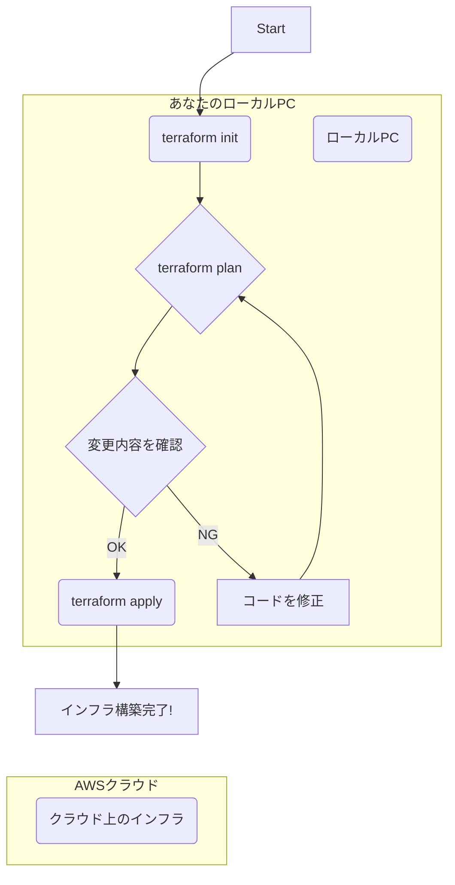
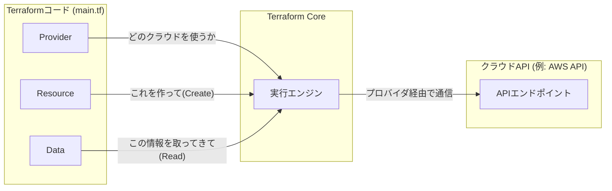

# 第1部: 基礎編 - Terraformの世界へようこそ

## 第1章: Terraformとは何か？IaCの基礎を理解しよう

### はじめに

この章では、Terraformの学習を始めるにあたって最も重要な基礎概念を学びます。

*   なぜ今「**Infrastructure as Code (IaC)**」が必要とされているのか？
*   数あるツールの中で、なぜ「**Terraform**」が選ばれるのか？
*   Terraformを支える**3つのコアコンセプト**とは何か？
*   Terraformの**基本的なコマンドの流れ**はどうなっているのか？

これらの疑問を解消し、Terraformの世界への第一歩を力強く踏み出しましょう！

---

### 1.1 IaC（Infrastructure as Code）が解決する課題

かつて、サーバーやネットワークなどのITインフラを構築するには、専門のエンジニアがクラウドの管理画面を一つひとつクリックしたり、コマンドを一行ずつ手で入力したりするのが一般的でした。この手作業による管理には、いくつかの根深い課題がありました。

*   **ヒューマンエラー**: 「設定を一つ間違えた」「手順を飛ばしてしまった」といった人的ミスが、大規模なシステム障害に繋がる可能性があります。
*   **属人化**: 特定のインフラの構築方法が、担当者の頭の中にしか存在しない状態です。その人が退職・異動すると、誰もそのインフラを修正・複製できなくなります。
*   **再現性の欠如**: 同じ手順書を見ながら作業しても、微妙な設定の違いや手順の解釈の違いから、完全に同じ環境を再現するのは困難でした。開発環境と本番環境でなぜか挙動が違う、といった問題の原因になりがちです。
*   **変更履歴の不明確さ**: 「いつ、誰が、何のために、どこを変更したのか」を追跡することが難しく、問題が発生した際の調査が困難でした。

これらの課題を解決するアプローチが **Infrastructure as Code (IaC)** です。

**IaC**とは、その名の通り「**インフラをコードで定義・管理する**」という考え方です。
サーバーのスペック、ネットワーク設定、ファイアウォールのルールといったインフラの構成情報を、プログラミングコードのようにテキストファイル（設定ファイル）で記述します。

料理に例えるなら、手作業のインフラ構築が「勘と経験に頼る料理」だとすれば、IaCは「誰が作っても同じ味になる、詳細なレシピ」のようなものです。

この「レシピ（コード）」を使うことで、以下のようなメリットが生まれます。

*   **自動化による効率化とミスの削減**: コードを実行すれば、インフラが自動で構築されます。手作業がなくなるため、ヒューマンエラーを防ぎ、構築時間を大幅に短縮できます。
*   **バージョン管理**: コードをGitなどのバージョン管理システムで管理できます。「いつ、誰が、なぜ変更したか」の履歴がすべて残り、必要であれば過去の状態に簡単に戻すことも可能です。
*   **レビュープロセス**: インフラの変更をコードの変更として扱えるため、チームメンバーによるコードレビューが可能になります。これにより、設定ミスやセキュリティリスクを事前に発見し、品質を高めることができます。
*   **再現性と再利用性**: 同じコードを使えば、誰でも、いつでも、どこでも、全く同じ環境を構築できます。開発環境、ステージング環境、本番環境の一貫性を保つことが容易になります。

IaCは、現代の高速で変化の激しいシステム開発において、不可欠なプラクティスとなっています。

### 1.2 なぜTerraformか？（CloudFormation, Ansible, Pulumiとの比較）

IaCを実現するためのツールはいくつか存在します。ここでは代表的なツールとTerraformを比較し、なぜTerraformが広く支持されているのかを見ていきましょう。

| ツール名 | 特徴 | 言語 | クラウド対応 | 主な用途 |
| :--- | :--- | :--- | :--- | :--- |
| **Terraform** | **宣言的**、**マルチクラウド対応**、巨大なエコシステム | HCL (HashiCorp Configuration Language) | **◎ 非常に多い** | インフラのプロビジョニング |
| CloudFormation | AWS専用、AWSサービスとの深い連携 | YAML / JSON | △ (AWSのみ) | AWSインフラのプロビジョニング |
| Ansible | **手続き的**、エージェントレス、構成管理が得意 | YAML | ◯ 比較的多い | サーバーの構成管理（ミドルウェア導入など） |
| Pulumi | **宣言的**、使い慣れたプログラミング言語が使える | Python, Go, TypeScriptなど | ◎ 非常に多い | インフラのプロビジョニング |

**Terraformの主な強み:**

1.  **マルチクラウド対応**: これが最大の強みです。AWS, Azure, Google Cloud (GCP) といった主要クラウドはもちろん、GitHub, Datadog, Cloudflareなど、数百種類ものサービスに対応しています。これにより、特定のクラウドベンダーに縛られない「ベンダーロックイン」を避け、複数のサービスを組み合わせた複雑なシステムも一元管理できます。
2.  **宣言的な構文**: Terraformでは「**インフラがどうあるべきか（What）**」という最終的な状態を定義します。その状態に至るまでの「**具体的な手順（How）**」はTerraformが自動で判断してくれます。これにより、コードが簡潔で読みやすくなります。
3.  **巨大なコミュニティとエコシステム**: 非常に多くのユーザーと企業に利用されているため、学習リソースや再利用可能なコード（モジュール）が豊富に存在します。問題が発生しても、解決策を見つけやすい環境が整っています。
4.  **HCLの学習しやすさ**: Terraform独自のHCLという言語は、人間が読み書きしやすいように設計されており、プログラミング経験が浅い人でも比較的容易に学習を始めることができます。

**CloudFormation**はAWS環境に限定すれば強力ですが、他のサービスと連携したい場合には不向きです。**Ansible**はサーバー構築後のミドルウェアインストールといった「構成管理」に強みを持ち、Terraformと組み合わせて使われることも多いです。**Pulumi**は、普段使っているプログラミング言語で書きたい開発者にとっては魅力的ですが、インフラ専門のエンジニアにとっては専用言語であるHCLの方がシンプルで分かりやすいと感じる場合もあります。

これらの理由から、特に複数のクラウドやサービスを扱う現代的な環境において、TerraformはIaCツールの第一選択肢となっています。

### 1.3 Terraformの3つのコアコンセプト

Terraformの魔法を理解するには、3つの重要なコンセプトを知る必要があります。

1.  **宣言的構文 (Declarative Syntax)**
    前述の通り、Terraformは「宣言的」です。これは「命令」ではなく「宣言」でインフラを定義することを意味します。
    *   **手続き的（命令）**: 「EC2インスタンスを1台作る。次に、セキュリティグループを作成する。最後に、インスタンスにそのグループを紐付ける。」
    *   **宣言的（宣言）**: 「t2.microタイプのEC2インスタンスが1台存在するべきだ。そして、そのインスタンスはポート80を開けたセキュリティグループに所属しているべきだ。」

    宣言的に書くことで、コードはインフラの「設計図」そのものになります。現在の状態がどうであれ、Terraformはこの設計図通りになるように、必要な作成・変更・削除を自動的に計算して実行してくれます。

2.  **状態管理 (State Management)**
    Terraformの最も重要な心臓部です。Terraformは、コード（あるべき姿）と、実際に存在するインフラ（現実の姿）を比較して、その差分を検出します。この「現実の姿」を記録しているのが**Stateファイル** (`terraform.tfstate`) です。

    Stateファイルは、Terraformが管理しているリソースの情報（IDやIPアドレスなど）をJSON形式で記録したファイルです。Terraformは`apply`コマンドを実行するたびに、このStateファイルを更新します。

    もしStateファイルがなければ、Terraformは自分が何を作ったのかを忘れてしまい、毎回新しいリソースを作ろうとしてしまうでしょう。Stateファイルがあるからこそ、変更や削除を正確に管理できるのです。
    **※チームで開発する際は、このStateファイルを共有するための仕組み（リモートバックエンド）が不可欠になります。これは後の章で詳しく学びます。**

3.  **プロバイダ (Providers)**
    Terraformがマルチクラウドを実現するための仕組みがプロバイダです。プロバイダは、AWSやAzure、GCPなどの各プラットフォームのAPIと対話するための「翻訳機」や「アダプター」のような役割を担います。

    ```hcl
    # このコードはAWSプロバイダを利用することを宣言している
    terraform {
      required_providers {
        aws = {
          source  = "hashicorp/aws"
          version = "~> 5.0"
        }
      }
    }
    
    # AWSプロバイダに東京リージョンを使うように設定
    provider "aws" {
      region = "ap-northeast-1"
    }
    ```

    使いたいサービスのプロバイダをコードで宣言するだけで、Terraformはそのサービスを操作する能力を獲得します。AWS用のリソースとGCP用のリソースを、同じファイル内に記述して一括管理することも可能です。この拡張性の高さが、Terraformを非常に強力なツールにしています。

### 1.4 Terraformの基本的な動作フロー（init -> plan -> apply）

Terraformを使った作業は、主に3つのコマンドを中心としたシンプルなサイクルで進みます。

`init` → `plan` → `apply`


*(出典: Terraform by HashiCorp)*

1.  **`terraform init` (初期化)**
    作業ディレクトリで最初に実行するコマンドです。このコマンドは、コード内に記述されたプロバイダ（例: `hashicorp/aws`）を探し出し、インターネットから必要なプラグインをダウンロードしてきます。また、Stateファイルを保存するバックエンドの初期化も行います。料理で言えば、調理を始める前に必要な調理器具や材料をキッチンに揃える工程です。

2.  **`terraform plan` (実行計画のプレビュー)**
    コード（あるべき姿）とStateファイル（現在の姿）を比較し、インフラを「あるべき姿」にするために、どのような変更（作成・変更・削除）が必要かを分析します。その結果を人間が読める形式で画面に表示してくれます。
    *   `+ create`: このリソースは新しく作成されます。
    *   `~ update`: このリソースは変更されます。
    *   `- destroy`: このリソースは削除されます。

    このステップがあることで、意図しない変更がインフラに加わるのを防ぐことができます。実際の作業前に「見積もり」を確認する、非常に重要な安全装置です。

3.  **`terraform apply` (実行計画の適用)**
    `plan`で表示された実行計画に問題がなければ、このコマンドで実際のインフラに変更を適用します。コマンドを実行すると、再度`plan`と同じ内容が表示され、「`yes`」と入力するよう求められます。このワンクッションがあることで、誤った操作を防いでくれます。`apply`が正常に完了すると、Stateファイルが最新のインフラの状態を反映するように更新されます。

---

#### 補足: `terraform destroy`
作成したインフラをすべて削除したい場合は、`terraform destroy`コマンドを使います。このコマンドも、削除対象のリソースを一覧表示し、実行確認を求めてくるため安全です。学習や検証で作成した環境を、コマンド一つで綺麗に片付けられるので非常に便利です。

---

### まとめ

お疲れ様でした！この章では、Terraformを学ぶ上での土台となる知識を身につけました。

> *   **IaC**は、手作業によるインフラ管理の課題（ミス、属人化、再現性の欠如）を**コードで解決する**アプローチである。
> *   **Terraform**は、**マルチクラウド対応**と**宣言的な構文**を強みとする、デファクトスタンダードなIaCツールである。
> *   Terraformは「**宣言的構文**」「**状態管理**」「**プロバイダ**」という3つのコアコンセプトで成り立っている。
> *   基本的な作業フローは、**`init` (準備) → `plan` (確認) → `apply` (実行)** の3ステップである。

次の章では、いよいよあなたのPCにTerraformをインストールし、最初のインフラをコードで構築するまでを体験します。

承知いたしました。
それでは、第2章と第3章の学習コンテンツをマークダウン形式で作成します。ご要望のあったMermaid記法も活用して、視覚的に理解しやすいように記述します。

---

## 第2章: 環境準備：Terraformを始めよう

### はじめに

理論を学んだら、次は実践です！この章では、あなたのローカルマシンにTerraformを動かすための環境を構築します。ツールのインストールからクラウドへの認証設定、そして最初のインフラを`apply`するまでの全手順を、一つひとつ丁寧に解説します。この章を終える頃には、あなたはTerraformの基本的なサイクルを一人で回せるようになっているでしょう。

---

### 2.1 インストールとバージョン管理（tfenvの活用）

Terraformは活発に開発されており、頻繁にバージョンアップが行われます。しかし、プロジェクトによっては古いバージョンを使い続ける必要があったり、チーム内でバージョンを統一する必要があったりします。

そこで役立つのが、Terraformのバージョンマネージャーである **`tfenv`** です。`tfenv`を使うと、複数のTerraformバージョンを簡単に切り替えて利用できます。

**なぜ`tfenv`を使うのか？**
*   **プロジェクトごとにバージョンを固定**: `.terraform-version` というファイルを置くだけで、そのディレクトリで使うTerraformのバージョンを自動で切り替えられます。
*   **チーム開発でのバージョン統一**: Gitリポジトリに `.terraform-version` を含めることで、チームメンバー全員が同じバージョンのTerraformを使うことを強制でき、意図しない挙動の差を防ぎます。

#### インストール手順 (macOS / Linux)

Homebrewを使っている場合、インストールは非常に簡単です。

```bash
# tfenvをインストール
brew install tfenv

# 利用可能なTerraformのバージョン一覧を表示
tfenv list-remote

# 最新の安定版をインストール
tfenv install latest

# インストールしたバージョンをグローバルで利用する設定
tfenv use latest
```

#### 使い方
プロジェクトのディレクトリで、使いたいバージョンを記述したファイルを作成します。

```bash
# my-terraform-project ディレクトリに移動
cd my-terraform-project

# 使用するバージョンをファイルに記述
echo "1.8.2" > .terraform-version

# これで、このディレクトリ内では自動的に 1.8.2 が使われる
terraform --version
# => Terraform v1.8.2
```

---

### 2.2 主要クラウドプロバイダの認証設定（AWS, Azure, GCP）

Terraformがクラウドを操作するには、あなたがそのクラウドのアカウントに対する正当な権限を持っていることを証明する「認証」が必要です。ここでは最も一般的なAWSを例に、認証設定の方法を解説します。

#### AWSの認証設定

AWSの操作権限を持つ **IAMユーザー** の **アクセスキー** を利用する方法が最も手軽です。
（**注意**: 本番環境ではIAMロールなど、よりセキュアな方法が推奨されます。これは後の章で学びます。）

1.  **AWS CLIのインストール**: AWSの操作を行うための公式コマンドラインツールをインストールします。
    ```bash
    # macOSの場合
    brew install awscli
    ```

2.  **IAMユーザーの作成とアクセスキーの発行**:
    *   AWSマネジメントコンソールにログインします。
    *   IAMサービスに移動し、「ユーザー」から「ユーザーを作成」をクリックします。
    *   ユーザー名（例: `terraform-user`）を入力し、適切なポリシー（例: `AdministratorAccess`、学習用）をアタッチします。
    *   作成後、「セキュリティ認証情報」タブから「アクセスキーを作成」し、表示される **アクセスキーID** と **シークレットアクセスキー** を必ず安全な場所に控えてください。（**このキーは絶対にGitなどで公開しないでください！**）

3.  **認証情報の設定**:
    `aws configure` コマンドを実行し、先ほど取得したキーを設定します。

    ```bash
    aws configure
    ```

    対話形式で以下の情報を入力します。
    *   **AWS Access Key ID**: `[あなたのアクセスキーID]`
    *   **AWS Secret Access Key**: `[あなたのシークレットアクセスキー]`
    *   **Default region name**: `ap-northeast-1` (東京リージョンなど)
    *   **Default output format**: `json`

これで設定は完了です。Terraformは自動的にこの設定情報を読み取り、AWSの認証を行います。

<details>
<summary>Azure, GCPの認証設定（クリックで展開）</summary>

#### Azureの認証設定
Azure CLIをインストールし、ログインするのが最も簡単です。
```bash
# Azure CLIをインストール (macOS)
brew install azure-cli

# ブラウザが開き、認証が求められる
az login
```
Terraformは自動でこのログイン情報を利用します。

#### GCPの認証設定
Google Cloud CLI (gcloud) をインストールし、ログインします。
```bash
# gcloud CLIをインストール (macOS)
brew install --cask google-cloud-sdk

# 認証とプロジェクト設定
gcloud auth application-default login
gcloud config set project [あなたのGCPプロジェクトID]
```
Terraformは自動でこの認証情報を利用します。

</details>

---

### 2.3 エディタと推奨ツール（VS Code, HCL Linter, フォーマッタ）

Terraformのコード(HCL)を効率的に書くために、開発環境を整えましょう。**Visual Studio Code (VS Code)** が最も人気で、強力な拡張機能が揃っています。

#### 推奨VS Code拡張機能

1.  **HashiCorp Terraform** (公式拡張)
    *   **必須**。シンタックスハイライト、コード補完、ドキュメント表示など、Terraform開発に必要な機能がすべて詰まっています。

2.  **tflint**
    *   Terraformの静的コード解析ツール（リンター）。コードの間違いや非推奨な書き方、AWSのインスタンスタイプが存在しないといった、`plan`では気づけない問題を事前に検知してくれます。
    *   `brew install tflint` で本体をインストール後、VS Code拡張を入れます。

3.  **Prettier - Code formatter**
    *   コードのインデントやスペースを自動で整形してくれるフォーマッタ。Terraformには公式の`terraform fmt`コマンドがありますが、Prettierは保存時に自動で整形してくれるため便利です。

これらのツールを導入することで、コードの品質を保ち、開発スピードを大幅に向上させることができます。

---

### 2.4 最初のTerraformコードとapplyまでの流れ

いよいよ、Terraformを使って実際にクラウド上にリソースを作成します。ここでは、AWS上にシンプルな **VPC (Virtual Private Cloud)** を1つ作成してみましょう。

**1. 作業ディレクトリとファイルの作成**
まず、プロジェクト用のディレクトリを作成し、その中に`main.tf`というファイルを作成します。

```bash
mkdir first-infra
cd first-infra
touch main.tf
```

**2. コードの記述 (`main.tf`)**
`main.tf`に以下のコードを記述してください。

```hcl
// main.tf

// 1. Terraformとプロバイダのバージョンを定義
terraform {
  required_providers {
    // 今回はAWSプロバイダを使うことを宣言
    aws = {
      source  = "hashicorp/aws"
      version = "~> 5.0"
    }
  }
}

// 2. プロバイダの設定
// どのリージョンで作業するかを指定
provider "aws" {
  region = "ap-northeast-1" // 東京リージョン
}

// 3. リソースの定義
// ここで「何を作りたいか」を宣言する
resource "aws_vpc" "main" {
  // CIDRブロック（VPCのIPアドレス範囲）を指定
  cidr_block = "10.0.0.0/16"

  // リソースにタグを付ける（管理をしやすくするため）
  tags = {
    Name = "my-first-vpc-from-terraform"
  }
}
```

**3. Terraformコマンドの実行**
ターミナルで、`main.tf`があるディレクトリで以下のコマンドを順に実行します。



*   **`terraform init`**: プロバイダをダウンロードします。
    ```bash
    terraform init
    ```
    `Terraform has been successfully initialized!` と表示されれば成功です。`.terraform`ディレクトリと`.terraform.lock.hcl`ファイルが生成されます。

*   **`terraform plan`**: 実行計画を確認します。
    ```bash
    terraform plan
    ```
    以下のような出力が表示され、`aws_vpc`が1つ`create`されることがわかります。
    ```diff
    Plan: 1 to add, 0 to change, 0 to destroy.
    
    + resource "aws_vpc" "main" {
    +   id                               = (known after apply)
    +   arn                              = (known after apply)
    +   cidr_block                       = "10.0.0.0/16"
    +   ... (他多数の属性)
    +
    +   tags = {
    +     "Name" = "my-first-vpc-from-terraform"
    +   }
    + }
    ```

*   **`terraform apply`**: 計画を適用し、実際にリソースを作成します。
    ```bash
    terraform apply
    ```
    `plan`と同じ内容が表示された後、`Do you want to perform these actions?` と聞かれるので `yes` と入力してEnterキーを押します。
    
    `Apply complete! Resources: 1 added, 0 changed, 0 destroyed.` と表示されれば成功です！

**4. 確認と後片付け**
AWSマネジメントコンソールにログインし、VPCのページを開いてみてください。「my-first-vpc-from-terraform」という名前のVPCが作成されているはずです。

最後に、作成したリソースを削除しましょう。
```bash
terraform destroy
```
`Destroy complete! Resources: 1 destroyed.` と表示されれば、きれいに片付け完了です。

おめでとうございます！これであなたはTerraformの基本的な操作をマスターしました。

---
---

## 第3章: HCLマスター：Terraformの言語を学ぶ

### はじめに

Terraformのコードは、HCL (HashiCorp Configuration Language) という独自の言語で記述します。HCLは人間が読み書きしやすいように設計されており、直感的で学習しやすいのが特徴です。この章では、HCLの主要な構成要素である「リソース」「データソース」「変数」「出力」などを学び、静的な設定だけでなく、より動的で再利用性の高いコードを書くためのテクニックを習得します。

---

### 3.1 プロバイダ、リソース、データソースの基本

Terraformのコードは、主に以下の3つのブロックタイプで構成されます。



1.  **プロバイダ (`provider`)**:
    第2章でも触れましたが、これはTerraformがどのプラットフォーム（AWS, Azure, etc.）と通信するかを定義するブロックです。リージョンやプロファイルなど、そのプロバイダ全体に関わる設定をここで行います。
    ```hcl
    provider "aws" {
      region = "ap-northeast-1"
    }
    ```

2.  **リソース (`resource`)**:
    **「これを作ってください」** というTerraformへの指示です。IaCの中核をなすブロックで、EC2インスタンス、S3バケット、VPCなど、実際に作成・管理したいインフラ資源を定義します。
    ```hcl
    // 構文: resource "リソースタイプ" "リソース名" { ... }
    
    // "aws_instance" というタイプのリソースを
    // "web_server" という名前でコード内で管理する
    resource "aws_instance" "web_server" {
      ami           = "ami-0c55b159cbfafe1f0" // 使うOSイメージ
      instance_type = "t2.micro"             // インスタンスのサイズ
    
      tags = {
        Name = "HelloWorld"
      }
    }
    ```
    *   **リソースタイプ (`aws_instance`)**: プロバイダによって定義されています。「AWSのEC2インスタンス」を意味します。
    *   **リソース名 (`web_server`)**: このTerraformコード内でユニークな名前です。他のリソースから参照する際に使います。

3.  **データソース (`data`)**:
    **「すでに存在する情報を取ってきてください」** という指示です。リソースを作成するのではなく、既存のリソースやアカウント情報を参照して、その値をコード内で利用したい場合に使います。
    
    例えば、リージョンごとに最適なAMI（OSイメージ）のIDをハードコーディングするのではなく、AWSから動的に取得したい場合に便利です。
    ```hcl
    // 構文: data "データソースタイプ" "データソース名" { ... }

    // 最新のAmazon Linux 2のAMI情報を取得する
    data "aws_ami" "latest_amazon_linux" {
      most_recent = true
      owners      = ["amazon"]
    
      filter {
        name   = "name"
        values = ["amzn2-ami-hvm-*-x86_64-gp2"]
      }
    }
    
    // dataで取得したAMI IDをresourceで利用する
    resource "aws_instance" "web_server" {
      // data.データソースタイプ.データソース名.属性
      ami           = data.aws_ami.latest_amazon_linux.id
      instance_type = "t2.micro"
    }
    ```
    `data`を使うことで、コードがより環境に依存しなくなり、メンテナンス性が向上します。

---

### 3.2 変数（Variables）と型制約、terraform.tfvarsでの管理

コード内に直接値を書き込む（ハードコーディング）と、環境ごとに値を変更したい場合にコード自体を修正する必要があり、非常に不便です。そこで**変数（Variables）**を使います。

#### 変数の宣言 (`variables.tf`)

`variable`ブロックを使って変数を宣言します。通常、変数は`variables.tf`という専用のファイルにまとめます。

```hcl
// variables.tf

variable "instance_type" {
  description = "EC2インスタンスのタイプ"
  type        = string // 型制約: この変数は文字列でなければならない
  default     = "t2.micro" // デフォルト値
}

variable "common_tags" {
  description = "すべてのリソースに付与する共通タグ"
  type        = map(string) // 型制約: キーも値も文字列のマップ
  default = {
    Project   = "MyProject"
    ManagedBy = "Terraform"
  }
}
```
*   `description`: この変数が何のためのものかを説明します。チーム開発では非常に重要です。
*   `type`: 変数の型を制約します（`string`, `number`, `bool`, `list`, `map`, `object`など）。意図しない型の値が入るのを防ぎます。
*   `default`: 値が指定されなかった場合に利用されるデフォルト値です。

#### 変数の利用 (`main.tf`)
`var.`というプレフィックスを付けて変数を参照します。

```hcl
// main.tf

resource "aws_instance" "web_server" {
  ami           = data.aws_ami.latest_amazon_linux.id
  instance_type = var.instance_type // 変数を参照

  // merge関数で共通タグと個別タグを結合
  tags = merge(
    var.common_tags,
    {
      Name = "WebServer-prod"
    }
  )
}
```

#### 変数への値の注入 (`terraform.tfvars`)

変数の値を外部から与えるには、**`terraform.tfvars`** というファイルを使います。Terraformは`apply`や`plan`を実行する際に、このファイルを自動的に読み込みます。

```hcl
// terraform.tfvars

// デフォルト値を上書きする
instance_type = "t3.small"

common_tags = {
  Project     = "MyWebApp"
  Environment = "Production"
  ManagedBy   = "Terraform"
}
```

この仕組みにより、**コード (`.tf`)** と **設定値 (`.tfvars`)** を綺麗に分離できます。機密情報を含まない`.tfvars`のサンプル（`terraform.tfvars.example`）をGitで管理し、実際の値が入った`terraform.tfvars`は`.gitignore`に登録するのが一般的なプラクティスです。

---

### 3.3 出力（Outputs）による値の参照と共有

Terraformが作成したリソースの情報（例: EC2インスタンスのパブリックIPアドレス、LBのDNS名など）を、実行後にターミナルに表示したり、他のTerraformの構成から参照したりしたい場合があります。そのために**出力（Outputs）**を使います。

#### 出力の定義 (`outputs.tf`)
`output`ブロックで定義します。通常、`outputs.tf`という専用ファイルにまとめます。

```hcl
// outputs.tf

output "instance_public_ip" {
  description = "作成されたEC2インスタンスのパブリックIPアドレス"
  // 値の参照: リソースタイプ.リソース名.属性
  value = aws_instance.web_server.public_ip
}

output "instance_id" {
  description = "作成されたEC2インスタンスのID"
  value       = aws_instance.web_server.id
}
```

`terraform apply`が完了すると、`output`で定義した値がターミナルの最後に表示されます。
```
Outputs:

instance_id = "i-0123456789abcdef0"
instance_public_ip = "54.123.45.67"
```
`terraform output`コマンドで、いつでも出力値を表示できます。

---

### 3.4 組み込み関数、三項演算子、for式による動的な記述

HCLには、より動的で柔軟なコードを書くための機能が備わっています。

#### 組み込み関数
Terraformには多数の[組み込み関数](https://www.terraform.io/language/functions)が用意されています。
*   `length(<リスト>)`: リストの要素数を返します。
*   `lookup(<マップ>, <キー>, <デフォルト値>)`: マップからキーに対応する値を取得します。
*   `merge(<マップ1>, <マップ2>, ...)`: 複数のマップを結合します。
*   `cidrsubnet(<IP範囲>, <新しいビット数>, <ネットワーク番号>)`: サブネットのCIDRを計算します。

#### 三項演算子
条件によって値を切り替えたい場合に便利です。
`condition ? true_val : false_val`

```hcl
variable "is_production" {
  type    = bool
  default = false
}

resource "aws_instance" "web_server" {
  // 本番環境なら t3.medium、そうでなければ t3.micro を使う
  instance_type = var.is_production ? "t3.medium" : "t3.micro"
}
```

#### for式
リストやマップをループ処理して、新しいリストやマップを生成できます。
`[for <item> in <list> : <output_expression>]`

例えば、複数のサブネットIDのリストから、それぞれにタグを付ける設定を動的に生成したい場合などに強力です。

```hcl
variable "subnet_ids" {
  type    = list(string)
  default = ["subnet-a", "subnet-b", "subnet-c"]
}

// subnet_ids の各要素に "Name" タグを付けたオブジェクトのリストを生成する
locals {
  subnet_tags = [
    for id in var.subnet_ids : {
      id   = id,
      tags = { Name = "Subnet for ${id}" }
    }
  ]
}
// 結果:
// [
//   { id = "subnet-a", tags = { Name = "Subnet for subnet-a" } },
//   { id = "subnet-b", tags = { Name = "Subnet for subnet-b" } },
//   ...
// ]
```

---

### 3.5 ローカル変数（Locals）でDRYなコードを実現する

**DRY (Don't Repeat Yourself)** は「繰り返しを避けよ」というプログラミングの重要な原則です。同じ値や式をコードのあちこちに書いていると、修正が必要になったときにすべての箇所を直さなければならず、ミスや漏れの原因になります。

**ローカル変数 (`locals`)** を使うと、特定の値や式に名前を付けて、コード内で再利用できます。

#### ローカル変数の定義

`locals`ブロック内に、名前と値を定義します。
```hcl
// locals.tf

locals {
  // プロジェクト名と環境を変数から組み立て、共通のプレフィックスを定義
  name_prefix = "${var.project_name}-${var.environment}"
  
  // 共通タグを定義
  common_tags = {
    Project     = var.project_name
    Environment = var.environment
    ManagedBy   = "Terraform"
  }
}
```

#### ローカル変数の利用
`local.`というプレフィックスを付けて参照します。

```hcl
// main.tf

resource "aws_vpc" "main" {
  cidr_block = "10.0.0.0/16"
  
  tags = merge(
    local.common_tags,
    {
      // local変数を使ってリソース名を生成
      Name = "${local.name_prefix}-vpc"
    }
  )
}

resource "aws_subnet" "public" {
  vpc_id     = aws_vpc.main.id
  cidr_block = "10.0.1.0/24"

  tags = merge(
    local.common_tags,
    {
      // こちらでも同じプレフィックスを利用
      Name = "${local.name_prefix}-public-subnet"
    }
  )
}
```
このように`locals`を使うことで、
*   命名規則などを一元管理できる。
*   複雑な式を一度計算するだけで済む。
*   コードの可読性が向上し、DRYな状態を保てる。

といったメリットがあります。`variables`が「外部から注入する値」であるのに対し、`locals`は「コード内部で使う、計算結果や中間値」と考えると分かりやすいでしょう。

---

### まとめ

この章では、Terraformの言語であるHCLの基本から応用までを学びました。

> *   **リソース**は「作成」、**データソース**は「参照」。
> *   **変数 (Variables)**と`.tfvars`ファイルで、コードと設定を分離する。
> *   **出力 (Outputs)**で、作成したリソースの情報を外部から利用可能にする。
> *   **関数、三項演算子、for式**で、コードを動的で柔軟にする。
> *   **ローカル変数 (Locals)**で、コードをDRYに保ち、可読性を高める。

これらの知識は、次の「実践編」でスケーラブルなコードを設計していく上で、非常に重要な基礎となります。繰り返し手を動かして、HCLの文法に慣れていきましょう。