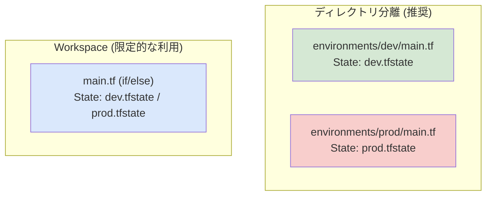
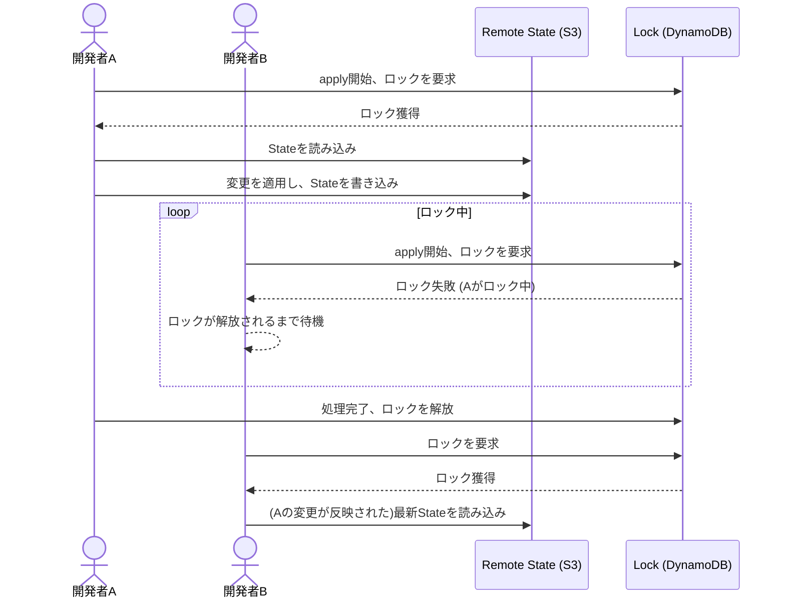

# 第2部: 実践編 - スケーラブルなコードを設計する

## 第4章: 設計思想：Terraformで"正しく"作るために

### はじめに

Terraformのコマンドを覚えるだけでは、スケーラブルで保守性の高いインフラを構築することはできません。この章では、Terraformを支える重要な設計思想である「イミュータブルインフラ」の考え方から、プロジェクトの成長に合わせてスケールするディレクトリ構成、環境ごとのリソースを安全に管理するための戦略まで、Terraformで"正しく"作るための考え方を学びます。

---

### 4.1 宣言的IaCとイミュータブル（不変）インフラの考え方

第1章で、Terraformは**宣言的**であると学びました。これは「どうあるべきか」というゴールを定義する考え方です。この宣言的なアプローチと非常に相性が良いのが、**イミュータブル（Immutable / 不変）インフラ**という考え方です。

#### ミュータブル（可変） vs イミュータブル（不変）

従来のインフラ管理は**ミュータブル（Mutable / 可変）**でした。
例えば、アプリケーションをバージョンアップする場合、既存のサーバーにSSHでログインし、パッケージを更新し、設定ファイルを書き換える、という作業を行っていました。この方法は、徐々に設定が変更されていくため「設定ドリフト（当初の構成からズレていくこと）」が発生しやすく、「このサーバーは一体どういう状態なのか」が誰も正確に把握できなくなる危険性がありました。

これを「ペット vs 家畜」の有名なアナロジーで説明します。

*   **ペット（ミュータブル）**: 一匹一匹に名前があり、病気になったら手厚く看病します。手作業で大事に育てられ、代替がききません。
*   **家畜（イミュータブル）**: 群れとして管理され、個体は識別番号で管理されます。病気の個体が出たら、群れ全体を守るために隔離・交換します。

**イミュータブルインフラ**は、この「家畜」のアプローチです。
インフラに変更（例: アプリのバージョンアップ）が必要になった場合、既存のサーバーを直接変更するのではなく、**新しいバージョンの設定を適用したサーバーを新しく構築し、古いサーバーは破棄します。**

```mermaid
sequenceDiagram
    participant V1 as Server v1.0
    participant V2 as Server v2.0
    participant LB as Load Balancer

    Note over V1, V2: イミュータブルなデプロイ
    LB ->> V1: トラフィックを送信
    
    rect rgb(230, 255, 230)
        Note over V2: 1. 新しいサーバーを構築
        create participant V2
    end
    
    rect rgb(230, 230, 255)
        Note over LB, V2: 2. トラフィックを切り替え
        LB -->> V2: トラフィックを送信
        LB --x V1: V1への送信を停止
    end

    rect rgb(255, 230, 230)
        Note over V1: 3. 古いサーバーを破棄
        destroy V1
    end
```

Terraformは、このイミュータブルインフラを自然に実現します。`instance_type`などを変更して`terraform apply`を実行すると、Terraformは多くの場合、既存のリソースを**変更(update)**するのではなく、**破棄(destroy)して再作成(create)**します。これにより、インフラは常にコード通りのクリーンな状態に保たれるのです。

**イミュータブルインフラのメリット:**
*   **予測可能性と一貫性**: インフラは常にコードから作成されるため、環境ごとの差異や「謎の設定」がなくなります。
*   **簡単なロールバック**: 問題が発生したら、古いバージョンのコードを使ってインフラを再作成するだけで、安全に以前の状態に戻せます。
*   **テストの容易さ**: 本番と全く同じ環境を簡単に用意できるため、変更を事前にテストすることが容易になります。

---

### 4.2 ディレクトリ構成のベストプラクティス（小規模から大規模まで）

プロジェクトの規模や複雑さに応じて、適切なディレクトリ構成を選択することが、長期的なメンテナンス性を大きく左右します。

#### レベル1: 小規模プロジェクト（フラット構成）
学習段階や、数個のリソースしかない個人プロジェクト向けの最もシンプルな構成です。

```
.
├── main.tf         # 全てのリソースをここに記述
├── variables.tf    # 変数定義
├── outputs.tf      # 出力定義
└── terraform.tfvars # 環境ごとの値 (Git管理外)
```

**メリット**: シンプルで分かりやすい。
**デメリット**: リソースが増えると `main.tf` が肥大化し、見通しが悪くなる。

#### レベル2: 中規模プロジェクト（モジュール分離構成）
Webサーバー、データベースなど、役割ごとにコードをまとめ、再利用性を高めたい場合の構成です。

```
.
├── main.tf         # 各モジュールを呼び出す
├── variables.tf
├── outputs.tf
├── terraform.tfvars
└── modules/        # 再利用可能な部品を格納
    ├── webserver/
    │   ├── main.tf
    │   ├── variables.tf
    │   └── outputs.tf
    └── database/
        ├── main.tf
        ├── variables.tf
        └── outputs.tf
```
ルートの`main.tf`は、各モジュールを呼び出すオーケストレーターの役割を果たします。

**メリット**: コードがコンポーネント化され、見通しと再利用性が向上する。
**デメリット**: ディレクトリ構造が少し複雑になる。

#### レベル3: 大規模プロジェクト（環境分離構成）
開発(dev)、ステージング(stg)、本番(prod)など、複数の環境を管理するための、最も実践的で推奨される構成です。

```
.
├── modules/          # 環境をまたいで共通で利用するモジュール
│   ├── vpc/
│   └── webserver/
└── environments/     # 環境ごとのディレクトリ
    ├── dev/
    │   ├── main.tf   # dev環境のモジュール呼び出し
    │   ├── backend.tf # dev環境用のtfstate設定
    │   └── terraform.tfvars
    ├── stg/
    │   ├── main.tf
    │   ├── backend.tf
    │   └── terraform.tfvars
    └── prod/
        ├── main.tf
        ├── backend.tf
        └── terraform.tfvars
```

**メリット**:
*   環境ごとにStateファイルが完全に分離され、安全性が非常に高い（dev環境の操作がprod環境に影響しない）。
*   環境間の差分（インスタンス数など）を `terraform.tfvars` で明確に管理できる。

**デメリット**:
*   設定の共通化のためにモジュール化が必須となる。
*   管理するディレクトリが増える（Terragruntなどのツールで効率化可能）。

---

### 4.3 環境分離戦略：Workspace と ディレクトリ構成の使い分け

Terraformには、環境を分離する方法として**ディレクトリ分離**の他に、**Workspace**という機能があります。

| 方法 | 概念 | メリット | デメリット |
| :--- | :--- | :--- | :--- |
| **ディレクトリ分離** | 環境ごとにコードとStateを物理的に分ける | 環境が完全に独立し安全。コードの差分が明確。 | モジュール化が必須。管理ディレクトリが増える。 |
| **Workspace** | 1つのコードで、環境ごとにStateを論理的に分ける | コードが1つで済む。環境の追加が簡単。 | コードが複雑化しやすい。誤操作のリスクが高い。 |

#### Workspaceの仕組み
Workspaceは、同じディレクトリ内で`terraform.tfstate.d`というディレクトリを作り、その中に`dev`や`prod`といった名前でStateファイルを切り替えて管理します。

```bash
# 新しいworkspaceを作成
terraform workspace new dev

# workspace一覧を表示 (*が現在のworkspace)
terraform workspace list
#* default
#  dev

# devに切り替え
terraform workspace select dev
```
コード内では `terraform.workspace` という変数で現在のWorkspace名を参照でき、三項演算子などで設定を切り替えます。

```hcl
// instance_countをworkspaceによって変更する例
resource "aws_instance" "server" {
  count = terraform.workspace == "prod" ? 3 : 1
  # ...
}
```

#### どちらを使うべきか？



**結論**: **原則としてディレクトリ分離を推奨します。**
Workspaceはコードが複雑化しやすく、`terraform workspace select prod` を忘れて `dev` のつもりで本番環境を操作してしまう、といったヒューマンエラーのリスクが常に伴います。

Workspaceが適しているのは、以下のような限定的なケースです。
*   個人開発で、一時的にテスト環境を複製したい場合。
*   構成がほぼ同じで、Stateファイルだけを分けたい場合。

チームで本格的に運用するシステムでは、安全性を最優先し、ディレクトリ分離構成を採用しましょう。

---

### 4.4 依存関係の管理（暗黙的な依存とdepends_on）

Terraformはリソース間の依存関係を自動的に解析し、正しい順序でリソースを作成・破棄します。例えば、「EC2インスタンスを作る前に、そのインスタンスが所属するセキュリティグループを先に作る」といった順序を自動で判断します。

#### 暗黙的な依存 (Implicit Dependency)
**これが最も推奨される方法です。**
あるリソースの引数で、他のリソースの属性を参照すると、Terraformは自動的に依存関係があると解釈します。

```hcl
resource "aws_security_group" "web_sg" {
  name = "web-sg"
  # ...
}

// aws_instanceは、aws_security_groupのIDを参照している
// → Terraformは「web_sgの後にapp_serverを作る」と判断する
resource "aws_instance" "app_server" {
  ami           = "..."
  instance_type = "t2.micro"
  
  // ここで暗黙的な依存が生まれる
  vpc_security_group_ids = [aws_security_group.web_sg.id]
}
```

#### 明示的な依存 (Explicit Dependency)
コード上で直接の参照関係はないものの、順序を制御したい場合に `depends_on` を使います。

```hcl
resource "aws_db_instance" "main_db" {
  # ... データベースの設定
}

resource "aws_instance" "app_server" {
  ami           = "..."
  instance_type = "t2.micro"

  # app_serverはDBの情報を直接参照しないが、
  # 起動スクリプトがDBの存在を前提としている場合など
  depends_on = [
    aws_db_instance.main_db
  ]
}
```
`depends_on` は、なぜこの依存関係が必要なのかがコードから読み取りにくくなるため、最後の手段と考えるべきです。可能な限り、暗黙的な依存で表現できないか検討しましょう。

---

## 第5章: モジュール開発：再利用可能なコードの作り方

### はじめに
DRY (Don't Repeat Yourself) は優れたコードの原則です。TerraformにおいてDRYを実現する最も強力な機能が**モジュール**です。この章では、再利用可能なインフラの部品（モジュール）を作成し、それらを組み合わせてシステム全体を構築する方法を学びます。

---

### 5.1 モジュールの基本構造と呼び出し方

モジュールとは、特定の目的を持つTerraformコード（`.tf`ファイル群）をまとめたディレクトリです。例えば、「VPCを作成するモジュール」「Webサーバーを構築するモジュール」のように、インフラの部品として扱えます。

#### モジュールの基本構造
モジュールは最低3つのファイルで構成されるのが一般的です。

*   `main.tf`: モジュールの本体。リソースを定義します。
*   `variables.tf`: モジュールの入力。呼び出し元から受け取る値を定義します。
*   `outputs.tf`: モジュールの出力。作成したリソースの情報を呼び出し元に返します。

**例: VPCモジュールの構造**
```
modules/
└── vpc/
    ├── main.tf      # aws_vpcやaws_subnetリソースを定義
    ├── variables.tf # vpc_cidrやsubnet_cidrsなどの変数を定義
    └── outputs.tf   # 作成したvpc_idやsubnet_idsを出力
```

#### モジュールの呼び出し方
`module` ブロックを使って、ルートの `main.tf` などからモジュールを呼び出します。

```hcl
// ルートの main.tf

module "my_app_vpc" { // "my_app_vpc" はこの呼び出しのローカル名
  // 1. モジュールの場所を指定
  source = "./modules/vpc" 

  // 2. モジュールの変数に値を渡す
  vpc_cidr     = "10.0.0.0/16"
  subnet_cidrs = ["10.0.1.0/24", "10.0.2.0/24"]
  environment  = "dev"
}

// 3. モジュールの出力を他のリソースで利用する
resource "aws_instance" "server" {
  ami = "..."
  instance_type = "t2.micro"

  // module.<呼び出し名>.<出力名> で参照
  subnet_id = module.my_app_vpc.subnet_ids[0]
}
```
モジュールを使うことで、VPC作成の複雑なロジックがカプセル化され、呼び出し側は必要なパラメータを渡すだけで済むようになります。

---

### 5.2 Module Sourceとバージョン管理

`source` 引数には、ローカルパス以外にも様々な場所を指定できます。

*   **ローカルパス**: `source = "./modules/vpc"`
*   **Terraform Registry**: `source = "terraform-aws-modules/vpc/aws"`
  *   HashiCorp公式やコミュニティが作成した高品質なモジュールが公開されています。車輪の再発明を避け、ベストプラクティスに則ったインフラを素早く構築できます。
*   **Gitリポジトリ**: `source = "git::https://github.com/my-org/terraform-modules.git//vpc"`
  *   自社専用のモジュールをプライベートリポジトリで管理する場合などに使います。

#### バージョン管理の重要性
モジュールは常に進化します。意図しないモジュールの更新がインフラに予期せぬ変更をもたらすことを防ぐため、**バージョンを必ず固定しましょう。**

```hcl
module "my_app_vpc" {
  source  = "terraform-aws-modules/vpc/aws"
  version = "~> 5.0" // 5.x系の最新版を使う (5.x内での後方互換性は保たれる)
  // version = "5.1.2" // 特定のバージョンに完全固定することも可能
  
  # ...
}

module "my_internal_module" {
  source = "git::https://github.com/my-org/terraform-modules.git//vpc?ref=v1.2.3" // Gitのタグでバージョン指定
  
  # ...
}
```
バージョンを固定することで、インフラの再現性と安定性が飛躍的に向上します。

---

### 5.3 `count` と `for_each` によるリソースの動的生成

同じリソースを複数作成したい場合、`count` や `for_each` を使います。

#### `count` (旧来の方法)
指定された回数だけリソースを複製します。リソースはリスト（配列）として扱われます。
```hcl
// 3人のIAMユーザーを作成
resource "aws_iam_user" "users" {
  count = 3
  name  = "user-${count.index}" // 0, 1, 2 が入る
}
// 参照: aws_iam_user.users[0].name
```
**問題点**: リストの途中の要素（例: `user-1`）を削除したい場合、コードを `count=2` に変更すると、Terraformは `user-2` を削除しようとします。インデックスがずれてしまうため、変更に弱いという欠点があります。

#### `for_each` (推奨される方法)
マップまたはセットの各要素に対してリソースを1つ作成します。リソースはキーで一意に識別されます。

```hcl
variable "user_names" {
  type    = set(string)
  default = ["alice", "bob", "charlie"]
}

resource "aws_iam_user" "users" {
  // for_each にセットを渡す
  for_each = var.user_names

  // each.key と each.value で各要素を参照 (セットの場合は同じ値)
  name = each.key 
}
// 参照: aws_iam_user.users["alice"].name
```
**`for_each`のメリット**: `user_names` から `bob` を削除しても、`alice` と `charlie` のリソースには何の影響もありません。Terraformは `aws_iam_user.users["bob"]` だけを正確に削除します。

> **結論: リソースを複数作成する場合は、常に `for_each` を第一候補としてください。**

---

### 5.4 `dynamic` ブロックによるネストされた設定のループ処理

リソースの引数の中に、繰り返し設定したいブロックがある場合（例: セキュリティグループの複数の通信ルール）に `dynamic` ブロックを使います。

**`dynamic`を使わない場合 (DRYではない)**
```hcl
resource "aws_security_group" "web_sg" {
  # ...
  ingress {
    from_port   = 80
    to_port     = 80
    protocol    = "tcp"
    cidr_blocks = ["0.0.0.0/0"]
  }
  ingress {
    from_port   = 443
    to_port     = 443
    protocol    = "tcp"
    cidr_blocks = ["0.0.0.0/0"]
  }
}
```

**`dynamic`を使った場合 (DRY)**
```hcl
variable "ingress_ports" {
  type    = list(number)
  default = [80, 443]
}

resource "aws_security_group" "web_sg" {
  name = "web-sg"
  # ...

  dynamic "ingress" {
    // for_each でリストをループ
    for_each = var.ingress_ports

    // contentブロックに、生成したい設定ブロックの内容を記述
    content {
      from_port   = ingress.value // ingress.key, ingress.valueで値にアクセス
      to_port     = ingress.value
      protocol    = "tcp"
      cidr_blocks = ["0.0.0.0/0"]
    }
  }
}
```
`dynamic` ブロックを使うことで、設定の追加や削除が変数を変更するだけで済み、コードの保守性が格段に向上します。

---

### 5.5 汎用的なモジュールの設計パターンと公開

良いモジュールは、特定のプロジェクトだけでなく、様々な場面で再利用できるように設計されています。

**良いモジュールの特徴:**
1.  **単一責任の原則**: 1つのモジュールは1つのことだけを行う（例: VPCモジュールはVPC関連リソースだけを作成する）。
2.  **柔軟な変数**: 必須の変数と、デフォルト値を持つオプションの変数を明確に分ける。
3.  **意味のある出力**: 呼び出し元が必要としそうな情報（ID、IPアドレスなど）を `output` で適切に提供する。
4.  **優れたドキュメント**: `README.md` にモジュールの目的、必須変数、オプション変数、出力、使用例を明記する。

Terraform Registryに自作モジュールを公開することもできます。GitHubリポジトリを `terraform-<PROVIDER>-<NAME>` という命名規則で作成し、セマンティックバージョニングに従ってタグを打つだけで、誰でも使えるようになります。

---

## 第6章: 状態管理（State Management）の詳解

### はじめに
Terraformの心臓部である**Stateファイル** (`terraform.tfstate`)。これはTerraformが管理するインフラの「現実の姿」を記録したデータベースです。一人で学習している間は問題になりませんが、チームで開発を始めると、このStateファイルの管理が極めて重要になります。

---

### 6.1 リモートバックエンドの重要性と設定方法（S3, Terraform Cloud）

デフォルトでは、Stateファイルは `terraform.tfstate` という名前でローカルに作成されます。これにはいくつかの致命的な問題があります。

*   **共有できない**: チームメンバーが同じインフラを操作できません。
*   **紛失リスク**: あなたのPCが壊れたら、インフラの状態が分からなくなります。
*   **機密情報**: Stateファイルにはパスワードなどの機密情報が含まれる場合があります。

これらの問題を解決するのが **リモートバックエンド** です。Stateファイルをローカルではなく、S3やTerraform Cloudといった共有ストレージに保存する仕組みです。

```mermaid
graph TD
    subgraph "ローカル (問題あり)"
        A[開発者A<br>terraform.tfstate]
        B[開発者B<br>terraform.tfstate]
        A --- B
    end
    subgraph "リモートバックエンド (解決策)"
        C[開発者A] -- "読み書き" --> D{Remote State<br>(S3, Terraform Cloud)}
        E[開発者B] -- "読み書き" --> D
    end
    style A fill:#F8CECC
    style B fill:#F8CECC
```

#### 設定方法 (AWS S3 + DynamoDB)
最も一般的なAWSでの設定例です。

1.  **事前準備**:
    *   Stateファイルを保存するためのS3バケットを1つ作成します。
    *   Stateロック用のDynamoDBテーブルを1つ作成します。
2.  **コードの記述**:
    `backend.tf`のようなファイルを作成し、`terraform` ブロック内に `backend` ブロックを記述します。

    ```hcl
    // backend.tf
    
    terraform {
      backend "s3" {
        bucket         = "my-terraform-state-bucket-unique-name" // 事前に作成したS3バケット名
        key            = "global/s3/terraform.tfstate"           // バケット内のStateファイルのパス
        region         = "ap-northeast-1"
        dynamodb_table = "my-terraform-state-lock-table"         // 事前に作成したDynamoDBテーブル名
        encrypt        = true
      }
    }
    ```
3.  **初期化**:
    `terraform init` を実行すると、バックエンド設定が読み込まれ、StateファイルをS3に移行するか聞かれます。`yes`と答えると設定が完了します。

---

### 6.2 Stateロッキングによるチームでの安全な共同作業

もし2人の開発者が同時に `terraform apply` を実行したらどうなるでしょうか？両者が古いStateを元に処理を始め、後から完了した方の変更が先に完了した方の変更を上書きしてしまい、Stateファイルが矛盾した状態になってしまいます。

これを防ぐのが **Stateロッキング** です。
誰かが `apply` などの書き込み操作を開始すると、Stateファイルを「ロック」し、他の人が同時に書き込み操作を実行できないようにします。


S3バックエンドの場合、`dynamodb_table` を指定するだけで、このロック機能が自動的に有効になります。

---

### 6.3 Stateファイルの操作コマンド

Stateファイルは直接編集すべきではありませんが、Terraformが提供するコマンドを使えば安全に操作できます。

*   `terraform state list`
    Stateが管理しているすべてのリソースを一覧表示します。
    `module.my_app_vpc.aws_vpc.main`

*   `terraform state show <アドレス>`
    特定のリソースの属性（Stateに記録されている値）を詳細に表示します。
    `terraform state show module.my_app_vpc.aws_vpc.main`

*   `terraform state mv <旧アドレス> <新アドレス>`
    リソースのコードをリファクタリング（例: リソース名を変更、モジュールに移動）した際に使います。インフラ自体には変更を加えず、Stateファイル内のリソースのアドレスだけを変更します。
    `terraform state mv aws_instance.server module.webserver.aws_instance.main`

*   `terraform state rm <アドレス>`
    Terraformの管理下からリソースを外します。**インフラ自体は削除されません。** 「このリソースだけ手動で管理したい」といった特殊なケースで使います。

---

### 6.4 既存インフラの取り込み（`terraform import`）

すでに手動や別のツールで作成されたインフラを、Terraformの管理下に置きたい場合があります。そのためのコマンドが `terraform import` です。

**手順:**
1.  **コードを書く**: 取り込みたいリソースの定義を `.tf` ファイルに記述します。値はダミーでも構いません。
    ```hcl
    resource "aws_s3_bucket" "existing_bucket" {
      // 中身は空でもOK
    }
    ```
2.  **`import`コマンド実行**: `terraform import <リソースアドレス> <実際のID>` を実行します。S3バケットの場合、IDはバケット名です。
    ```bash
    terraform import aws_s3_bucket.existing_bucket my-manually-created-bucket
    ```
    これにより、Terraformは `my-manually-created-bucket` の現在の状態を読み込み、`aws_s3_bucket.existing_bucket` としてStateファイルに記録します。

3.  **`plan`で差分確認**: `terraform plan` を実行します。コードとStateに差分があれば表示されるので、コード側をStateに合うように修正します。`No changes.` と表示されれば、取り込みは成功です。

---

### 6.5 Stateファイルの破損からのリカバリー戦略

Stateファイルはあなたのインフラの設計図であり、非常に重要です。万が一破損したり、失われたりした場合のリカバリー戦略を準備しておくべきです。

1.  **バックアップ (最も重要)**:
    *   **S3バックエンド**: S3バケットの**バージョニングを必ず有効に**してください。これにより、誤った変更や削除があっても、過去のバージョンのStateファイルに簡単に復元できます。これが最も簡単で効果的な対策です。
    *   **Terraform Cloud**: 自動的にStateの履歴を管理してくれます。

2.  **手動でのリカバリー**:
    Stateファイルに軽微な不整合が発生した場合、`terraform state pull` でStateをローカルにダウンロードし、JSONを慎重に編集した後、`terraform state push` でアップロードして修正することも可能です。しかし、これは非常にリスクの高い操作であり、最終手段です。

3.  **最悪のシナリオ（State喪失）**:
    バックアップがなく、Stateが完全に失われた場合、道は険しくなります。
    *   `terraform import` を駆使して、既存のリソースを一つひとつ手作業でStateに再登録していく。
    *   既存インフラを（可能であれば）手動で削除し、`terraform apply` でゼロから再構築する。

**結論**: **リモートバックエンドを使い、バージョニングを有効にすること。** これがStateファイルを破損から守るための99%の答えです。