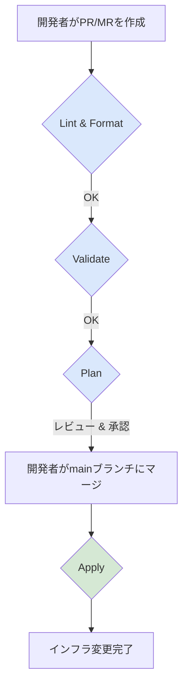
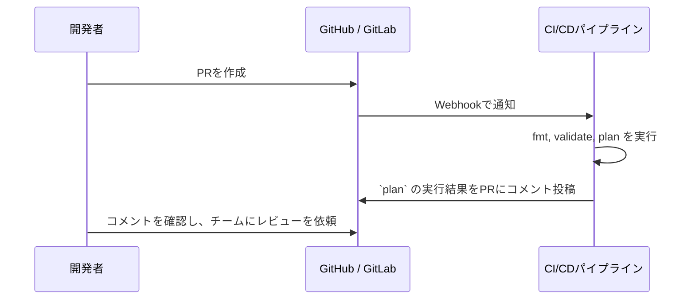
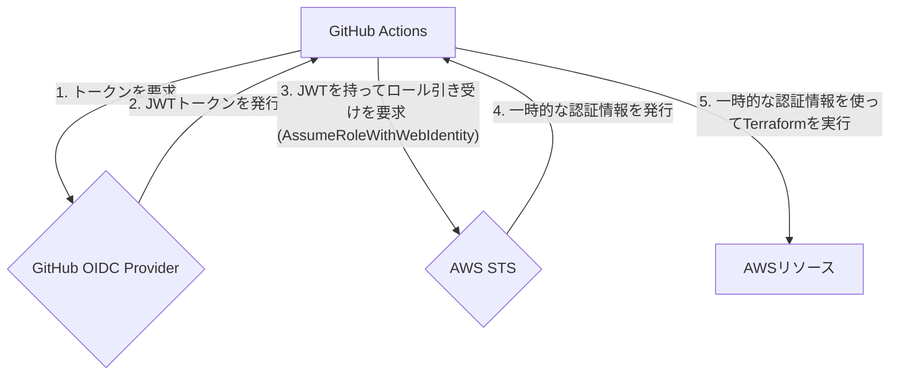
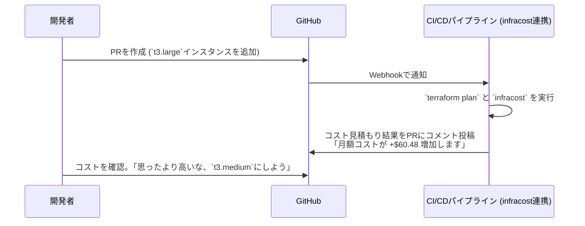

# 第3部: 運用・自動化編 - エンタープライズレベルのIaCへ

## 第7章: CI/CDパイプラインと自動化ワークフロー

### はじめに

手元のPCで `terraform apply` を実行するのは学習の第一歩ですが、チームでの開発や本番環境の運用では、手動実行はヒューマンエラーや屬人化の温床となります。この章では、CI/CD（継続的インテグレーション/継続的デリバリー）パイプラインを構築し、Terraformのワークフローを自動化・標準化する方法を学びます。これにより、インフラ変更の安全性、信頼性、速度を飛躍的に向上させることができます。

---

### 7.1 CI/CDの設計（GitHub Actions, GitLab CIでの実践例）

CI/CDツールは、Gitリポジトリへのプッシュやプルリクエスト（PR）/マージリクエスト（MR）の作成をトリガーとして、一連のコマンドを自動実行する仕組みです。TerraformのワークフローをCI/CDに組み込むことで、「Gitへのマージがインフラへの唯一の変更手段」という **GitOps** の思想を実現できます。

#### CI/CDパイプラインの基本構成

理想的なTerraformのCI/CDパイプラインは、以下のステージで構成されます。



#### GitHub Actionsでの実践例

GitHub Actionsは、リポジトリ内の `.github/workflows/` ディレクトリにYAMLファイルを配置するだけで、簡単にCI/CDを構築できます。

**サンプルワークフロー (`.github/workflows/terraform.yml`)**

```yaml
name: Terraform CI/CD

on:
  push:
    branches:
      - main # mainブランチにマージされたらApplyを実行
  pull_request: # PRが作成/更新されたらPlanまでを実行

jobs:
  terraform:
    runs-on: ubuntu-latest
    steps:
      - name: Checkout
        uses: actions/checkout@v3

      - name: Setup Terraform
        uses: hashicorp/setup-terraform@v2
        with:
          terraform_version: 1.8.0

      # AWSの認証情報を設定 (OIDCを利用するのがベストプラクティス)
      - name: Configure AWS Credentials
        uses: aws-actions/configure-aws-credentials@v4
        with:
          role-to-assume: arn:aws:iam::123456789012:role/github-actions-role # 事前に設定したIAMロール
          aws-region: ap-northeast-1

      - name: Terraform Init
        run: terraform init

      - name: Terraform Validate
        run: terraform validate

      - name: Terraform Plan
        # PRの時だけ実行
        if: github.event_name == 'pull_request'
        run: terraform plan -no-color
        
      - name: Terraform Apply
        # mainブランチへのpushの時だけ実行
        if: github.ref == 'refs/heads/main' && github.event_name == 'push'
        run: terraform apply -auto-approve
```
*   **GitLab CI/CD**: 同様のパイプラインを `.gitlab-ci.yml` ファイルで定義することで実現できます。基本的なステージ構成の考え方は同じです。

---

### 7.2 PR/MR駆動のワークフロー（`fmt`, `validate`, `plan`の自動化）

インフラの変更は、必ずプルリクエスト（PR）またはマージリクエスト（MR）を通じて行われるべきです。これにより、コードレビューのプロセスが必須となり、チーム全体で変更内容を把握・承認する文化が生まれます。

#### PR/MR作成時に自動実行されるべきステップ

1.  **`terraform fmt -check`**: コードフォーマットが規約通りかチェックします。フォーマットが崩れている場合はパイプラインを失敗させ、開発者に修正を促します。
2.  **`terraform validate`**: 構文エラーや設定の矛盾がないか検証します。基本的な文法ミスを早期に発見できます。
3.  **`terraform plan`**: 最も重要なステップです。このPR/MRをマージした場合に、**インフラにどのような変更（作成・変更・削除）が発生するか**を計画し、その結果をPR/MRのコメントとして投稿します。

#### `plan`結果のコメント投稿
`terraform plan` の結果をPRのコメントに自動投稿することで、レビュー担当者はGitHubやGitLabの画面を離れることなく、変更内容を正確に把握できます。



この自動化により、レビューの質と効率が大幅に向上します。`tfcmt`や`infracost`などのツールを使えば、`plan`の結果をより見やすく整形したり、コストへの影響をコメントに追加したりすることも可能です。

---

### 7.3 自動Applyの戦略と承認ワークフロー

`plan`の結果に問題がなければ、次は`apply`です。`apply`を自動化するかどうかは、組織のセキュリティポリシーやチームの成熟度によって戦略が分かれます。

#### 戦略1: 完全自動Apply
**トリガー**: `main`ブランチへのマージ
**方法**: PRがレビュー・承認され、`main`ブランチにマージされた瞬間に、CI/CDパイプラインが自動で`terraform apply`を実行します。
*   **メリット**: 最も高速で、インフラ変更のリードタイムが劇的に短縮されます。GitOpsの理想形です。
*   **デメリット**: レビュー漏れや`plan`の見落としが即座に本番環境に反映されるため、高いリスクを伴います。
*   **適している環境**: 開発(dev)環境、ステージング(stg)環境、またはチームのTerraform習熟度が非常に高い場合。

#### 戦略2: 手動承認を挟むApply
**トリガー**: `main`ブランチへのマージ後、手動での承認アクション
**方法**: `main`ブランチにマージされると`plan`までが実行され、パイプラインは一時停止します。権限を持つ管理者（SREやチームリーダーなど）が、最終的な`plan`の結果を確認し、承認ボタン（例: GitHub Actionsの`environment`機能や、ChatOps）をクリックすることで、初めて`apply`が実行されます。
*   **メリット**: `apply`の直前に人間による最終確認が入るため、安全性が高い。
*   **デメリット**: 自動化が途中で止まるため、リードタイムは少し長くなる。
*   **適している環境**: 本番(prod)環境、または厳格な変更管理が求められる環境。

> **推奨**: **開発環境は「完全自動Apply」、本番環境は「手動承認を挟むApply」** というハイブリッドなアプローチが、速度と安全性のバランスを取る上で最も現実的で効果的です。

---

### 7.4 IaCのテスト戦略

アプリケーションコードと同様に、IaCもテストが必要です。Terraformにおけるテストは、主に3つのレイヤーで考えます。

#### 1. 静的解析 (Static Analysis)
コードを実行する前に、コードそのものを解析して問題を発見します。
*   **ツール**: `terraform validate`, `TFLint`, `tfsec`, `checkov` (詳細は第8章)
*   **目的**: 構文エラー、ベストプラクティス違反、セキュリティの脆弱性、非効率なコードなどを検出する。
*   **実行タイミング**: PR/MR作成時。CIパイプラインの初期段階で実行する。

#### 2. 統合テスト (Integration Testing)
実際にインフラを**一時的に作成**し、それが期待通りに動作するかを確認するテストです。
*   **ツール**: `Terratest` (Go言語ベースのテストフレームワーク)
*   **目的**: 「作成したWebサーバーが実際にポート80で応答を返すか」「データベースに接続できるか」など、リソース間の連携や実際の動作を検証する。
*   **実行タイミング**: モジュールの開発時や、重要なインフラ変更時。テスト用のAWSアカウントなどで実行し、テスト完了後に`terraform destroy`でリソースをクリーンアップする。

#### 3. コンプライアンステスト (Compliance Testing)
インフラが構築された**後**に、それが組織のセキュリティポリシーやコンプライアンス要件（例: 「全てのS3バケットは暗号化されているか」）を満たしているかを継続的にチェックします。
*   **ツール**: `AWS Config`, `Azure Policy`, `Open Policy Agent (OPA)`
*   **目的**: 設定ドリフト（手動変更など）を検出し、インフラが常に準拠状態にあることを保証する。
*   **実行タイミング**: 定期的に（例: 毎日）、またはインフラ変更をトリガーとして実行する。

これらのテストを組み合わせることで、インフラの品質と信頼性を多層的に担保することができます。

---

## 第8章: セキュリティとコンプライアンス

### はじめに
IaCはインフラ構築を効率化しますが、コードの書き方次第では、大規模なセキュリティホールを意図せず生み出してしまう危険性もはらんでいます。この章では、Terraformを安全に運用するためのセキュリティ・プラクティスと、組織のガバナンスを強化するための手法を学びます。

---

### 8.1 IAMによる最小権限の原則とTerraform実行ロール

Terraformがクラウドを操作する際の権限は、**最小権限の原則 (Principle of Least Privilege)** に従うべきです。これは「Terraformが必要とする最小限の権限しか与えない」という考え方です。管理者の強力な権限をTerraformに与えるのは絶対に避けてください。

#### CI/CDでの推奨構成: OIDC + IAM Role
CI/CDパイプラインでTerraformを実行する場合、長期的なアクセスキーをパイプラインに保存するのは非常に危険です。代わりに、**OpenID Connect (OIDC)** を利用して、CI/CDプラットフォーム（GitHub Actionsなど）にIAMロールを一時的に引き受けさせる方法がベストプラクティスです。


この方法のメリット:
*   **キーが不要**: アクセスキーやシークレットキーを管理する必要がなくなります。
*   **短命な認証情報**: 発行される認証情報は有効期限が短く、漏洩時のリスクが低い。
*   **細かい権限制御**: リポジトリやブランチ単位で、どのロールを引き受けられるかを細かく制御できます。

---

### 8.2 機密情報の安全な管理

TerraformコードにデータベースのパスワードやAPIキーを直接書き込むのは、最もやってはいけないことの一つです。機密情報はコードから分離し、専用のシークレット管理サービスで安全に管理する必要があります。

#### 推奨される方法: データソースによる動的取得
機密情報を `terraform.tfvars` に書くのではなく、`apply`実行時に**データソース**を使ってシークレット管理サービスから動的に取得します。

**例: AWS Secrets Managerとの連携**
```hcl
// 1. Secrets Managerからシークレットの値を取得するデータソースを定義
data "aws_secretsmanager_secret_version" "db_credentials" {
  secret_id = "my-app/db/credentials" // Secrets Managerに保存したシークレットのID
}

// 2. 取得した値をリソースに渡す
resource "aws_db_instance" "default" {
  # ...
  // sensitive = true を付けると、plan/applyのログに値が表示されなくなる
  password = sensitive(jsondecode(data.aws_secretsmanager_secret_version.db_credentials.secret_string)["password"])
  username = sensitive(jsondecode(data.aws_secretsmanager_secret_version.db_credentials.secret_string)["username"])
}
```
この方法により、機密情報はGitリポジトリには一切記録されず、Terraformを実行するIAMロールだけがシークレットにアクセスできる、という安全な状態が実現します。**HashiCorp Vault**や**Azure Key Vault**でも同様の連携が可能です。

---

### 8.3 静的コード解析ツールによる脆弱性スキャン

`terraform validate` は構文しかチェックしませんが、セキュリティに特化した静的解析ツールを使うことで、コードに潜む脆弱性を早期に発見できます。

*   **tfsec**: Terraformコードに特化したセキュリティスキャナ。「暗号化されていないS3バケット」や「全世界に公開されているセキュリティグループ」など、一般的なセキュリティ設定ミスを100種類以上検出できます。
*   **Checkov**: Terraformだけでなく、CloudFormationやKubernetesマニフェストなど、様々なIaCツールに対応したスキャナ。CISベンチマークなどのコンプライアンス基準に基づいたチェックも可能です。

これらのツールはCIパイプラインに組み込むのが効果的です。`plan` の前に `tfsec` や `checkov` を実行し、脆弱性が検出されたらパイプラインを失敗させることで、セキュアでないインフラがデプロイされるのを防ぎます。

---

### 8.4 Policy as Codeによるガバナンス強化

静的解析ツールが「既知の悪いパターン」を見つけるのに対し、**Policy as Code (PaC)** は「組織独自のルール」を定義し、それを強制するための仕組みです。

**例: 組織独自のルール**
*   「本番環境では、`t2.micro` インスタンスの使用を禁止する」
*   「すべてのリソースには `Owner` タグが必須である」
*   「インフラは東京リージョン（`ap-northeast-1`）にしか作成してはならない」

#### Sentinel と Open Policy Agent (OPA)

*   **Sentinel**: Terraform Cloud/Enterpriseに組み込まれた、HashiCorp独自のポリシー言語。`plan`と`apply`の間にポリシーチェックを挟み、違反があれば実行をブロックできます。
*   **Open Policy Agent (OPA)**: CNCFの卒業プロジェクトで、より汎用的なポリシーエンジン。Regoという専用言語でポリシーを書き、Conftestのようなツールと組み合わせることで、CIパイプラインでTerraformの`plan`結果（JSON形式）を検証できます。

PaCを導入することで、セキュリティチームやインフラ管理者は、組織全体のガバナンスをコードで定義し、自動的に強制することができます。これにより、開発チームに自由を与えつつも、越えてはならない一線を守らせることが可能になります。

---

## 第9章: 大規模環境での運用戦略

### はじめに
プロジェクトが成長し、管理する環境、リージョン、アカウントが増えてくると、Terraformの標準的な使い方だけでは管理が煩雑になってきます。この章では、大規模環境を効率的かつDRYに管理するためのツールや設計パターンを学びます。

---

### 9.1 TerragruntによるDRYな構成管理と複数環境の効率的な運用

第4章で学んだ環境分離構成（`environments/dev`, `environments/prod`）は安全ですが、各環境の`backend.tf`や`provider.tf`に同じような記述が繰り返されるという問題があります。

**Terragrunt**は、Terraformの薄いラッパーツールで、この問題を解決します。

#### Terragruntの主な機能
1.  **DRYなバックエンド設定**: `backend`ブロックの設定を親ディレクトリの`terragrunt.hcl`に一元化し、各環境はそれを継承するだけで済みます。
2.  **複数モジュールの一括実行**: `terragrunt run-all apply`のようなコマンドで、複数のモジュール（ディレクトリ）にまたがる操作を一度に実行できます。
3.  **依存関係の管理**: モジュール間の依存関係（例: VPCを作成してから、そのVPC内にWebサーバーをデプロイする）を定義し、正しい順序で`apply`を実行できます。

**Terragruntを使ったディレクトリ構成例:**
```
.
└── live/
    ├── terragrunt.hcl   # 全環境で共通の設定 (バックエンド、プロバイダ)
    ├── dev/
    │   └── vpc/
    │       └── terragrunt.hcl # dev環境のVPCモジュールの変数を定義
    └── prod/
        └── vpc/
            └── terragrunt.hcl # prod環境のVPCモジュールの変数を定義
```
`terragrunt.hcl` には、呼び出すTerraformモジュールの`source`と、それに渡す`inputs`（変数）を記述します。Terraformコードそのものは、共通の`modules`リポジトリで管理するため、コードの重複が劇的に削減されます。

Terragruntは学習コストが少し高いですが、数十〜数百のStateを管理するような大規模環境では、その導入効果は絶大です。

---

### 9.2 複数リージョン・複数アカウント構成の設計パターン

グローバルなサービスを展開する場合、複数のリージョンやAWSアカウントを跨いでインフラを管理する必要が出てきます。

#### 複数リージョン
`provider`ブロックの`alias`機能を使えば、1つのTerraform構成から複数のリージョンにリソースを作成できます。

```hcl
provider "aws" {
  region = "us-east-1"
  alias  = "use1"
}
provider "aws" {
  region = "ap-northeast-1"
  alias  = "apne1"
}

// バージニア北部にリソースを作成
resource "aws_instance" "server_us" {
  provider = aws.use1
  # ...
}
// 東京にリソースを作成
resource "aws_s3_bucket" "bucket_jp" {
  provider = aws.apne1
  # ...
}
```

#### 複数アカウント
複数アカウントの管理はより複雑です。一般的には、AWS Organizationsを利用してアカウントを構造化し、各アカウントにTerraform実行用のIAMロールを作成します。CI/CDパイプラインが、操作対象のアカウントのロールを動的に引き受ける（`AssumeRole`）ことで、複数アカウントを操作します。

**設計パターン**:
*   **管理アカウント**: TerraformのStateやCI/CDパイプラインを配置する中央集権的なアカウント。
*   **実行アカウント**: 開発、本番などのワークロードが実際に稼働するアカウント。
*   管理アカウントのIAMロールが、各実行アカウントのIAMロールに`sts:AssumeRole`する権限を持つように設定します。

---

### 9.3 コスト管理と最適化（`infracost`によるコスト見積もり）

IaCの大きなメリットの一つは、インフラのコストをコードレベルで可視化できることです。

**Infracost**は、Terraformの`plan`結果を解析し、その変更が月額コストにどれくらい影響を与えるか（増加・減少）を見積もってくれるツールです。

**主な機能:**
*   **PR/MRへのコメント投稿**: CI/CDと連携し、「このPRをマージすると、月額コストが **+$50.25** 増加します」といったレポートを自動でコメントしてくれます。
*   **コストの内訳表示**: どのリソースがコストの主要因なのかを詳細に表示します。


Infracostを導入することで、開発者はコストを意識しながらコードを書くようになり、不要なコストの発生を未然に防ぐ「FinOps」の文化を醸成できます。

---

### 9.4 パフォーマンスチューニング（`plan`/`apply`の高速化）

管理するリソースが増えると、`terraform plan`や`apply`の実行時間が数分〜数十分とかかるようになり、開発サイクルが遅くなる原因となります。

**高速化のためのテクニック:**
1.  **Stateの分割**:
    最も効果的な方法です。巨大な単一のStateファイルを、コンポーネントやチーム単位で複数のStateファイルに分割します。例えば、「ネットワーク」「データベース」「アプリケーション」のように分けます。これにより、変更の影響範囲が限定され、`plan`/`apply`の対象リソースが減るため、実行時間が大幅に短縮されます。Terragruntは、このState分割を自然に実践するための優れたツールです。

2.  **`plan -refresh=false`**:
    `plan`実行時、TerraformはまずStateと実際のリソースの状態を同期（refresh）しようとします。リソース数が多いとこのrefreshに時間がかかります。インフラに手動変更がないと確信できる場合は、このオプションでrefreshをスキップし、`plan`を高速化できます。

3.  **`plan -target` (非推奨)**:
    `plan -target=aws_instance.my_server`のように、特定のリソースだけを対象に`plan`/`apply`を実行できます。しかし、依存関係が無視されるため、意図しない破壊を引き起こす可能性があり非常に危険です。デバッグなどの限定的な用途を除き、**日常的な運用での使用は絶対に避けてください。**

4.  **並列度の調整**:
    `-parallelism=n`オプションで、Terraformが同時に操作するリソース数を調整できます。デフォルトは10ですが、APIレートリミットに引っかからない範囲で数値を上げることで、`apply`を高速化できる場合があります。

パフォーマンスの問題に直面したら、まずは**Stateの分割**を検討するのが王道のアプローチです。