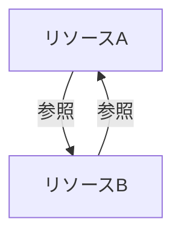

# 第4部: 発展編 - エコシステムとトラブルシューティング

## 第10章: トラブルシューティング：よくある問題と解決策

### はじめに
Terraformを使いこなしていくと、必ず様々なエラーや問題に直面します。この章では、初心者がつまずきやすい一般的な問題から、少し複雑なトラブルまで、その原因と具体的な解決策を解説します。エラーメッセージを恐れず、冷静に対処する能力を身につけましょう。

---

### 10.1 プロバイダの認証・権限エラー

`plan`や`apply`を実行した際に遭遇する最も一般的なエラーです。メッセージは様々ですが、根本原因は「TerraformがクラウドAPIを操作するための認証情報がない、または権限が不足している」ことです。

**典型的なエラーメッセージ:**
*   `Error: error configuring provider "aws": no valid credential sources found`
*   `Error: UnauthorizedOperation: You are not authorized to perform this operation.`
*   `Error: AccessDenied: User: arn:aws:iam::... is not authorized to perform: ec2:RunInstances`

**チェックリストと解決策:**
1.  **認証情報の設定確認**:
    *   **ローカル実行の場合**: `aws configure`で設定したプロファイルは正しいですか？ `~/.aws/credentials` と `~/.aws/config` の内容を確認してください。複数のプロファイルを使っている場合、環境変数 `AWS_PROFILE=your_profile_name` を設定するか、`provider` ブロックで `profile = "your_profile_name"` を指定していますか？
    *   **CI/CDの場合**: IAMロール（OIDC）の設定は正しいですか？ GitHub ActionsのワークフローやGitLab CIのYAMLファイルで、正しいロールARNを指定していますか？

2.  **権限（IAMポリシー）の確認**:
    *   エラーメッセージに注目してください。`is not authorized to perform: ec2:RunInstances` のように、**どの操作（Action）の権限が不足しているか**が明記されています。
    *   Terraformを実行しているIAMユーザーまたはIAMロールにアタッチされているIAMポリシーを確認し、不足している権限（この例では `ec2:RunInstances`）を追加してください。
    *   **AWS IAM Policy Simulator** を使うと、特定のアクションを実行できるかどうかを事前にテストできて便利です。

3.  **認証情報の有効期限切れ**:
    *   一時的な認証情報（STS経由で取得したものなど）を使っている場合、有効期限が切れている可能性があります。再度認証プロセス（例: `aws sso login`）を実行してください。

---

### 10.2 Stateファイルの不整合とロック問題

チーム開発でリモートバックエンドを使い始めると発生しやすい問題です。

#### Stateの不整合 (State Drift)
**症状**: コードは何も変更していないのに、`terraform plan`を実行すると変更が検出される。
**原因**: Terraformの外部で手動変更（コンソールでの設定変更など）が行われたため、Stateファイルの内容（Terraformが認識している状態）と、実際のインフラの状態がズレてしまっている状態です。
**解決策**:
*   **原則**: 手動変更は禁止し、すべての変更をTerraform経由で行う文化を徹底します。
*   **対処**:
    1.  `terraform plan` の結果を受け入れ、`terraform apply` を実行してインフラをコード通りの状態に戻す。（推奨）
    2.  手動変更が正しく、コードが古い場合は、コードの方を手動変更後の状態に合わせて修正し、`plan`の結果が `No changes.` となるようにする。
    3.  `terraform import` を使って、手動変更されたリソースを再度Stateに取り込む。

#### Stateロック問題
**症状**: `plan`や`apply`を実行すると、`Error acquiring the state lock` というエラーが表示され、処理が中断する。
**原因**:
*   他の誰かが同時に`apply`を実行している。
*   前回のTerraform実行が異常終了し、ロックが解放されずに残ってしまっている。
**解決策**:
1.  **状況確認**: まず、チームメンバーにTerraformを実行している人がいないか確認します。
2.  **ロック情報の確認**: S3バックエンドの場合、DynamoDBテーブルにロック情報が残っているか確認します。ロックIDから、誰がいつロックしたかを確認できます。
3.  **強制アンロック**: 誰も実行しておらず、ロックが残留していることが確実な場合にのみ、以下のコマンドでロックを強制的に解除します。
    ```bash
    # まずロックIDを取得
    terraform plan # (ここでエラーメッセージにIDが表示される)
    
    # 強制アンロック (実行には細心の注意を払うこと！)
    terraform force-unlock <LOCK_ID>
    ```
    **注意**: 強制アンロックは、本当に誰も操作していないことを確認してから行ってください。誤ったタイミングで実行すると、Stateファイルを破壊する可能性があります。

---

### 10.3 リソースの循環参照（Circular Dependency）の特定と解消法

**症状**: `plan`や`apply`を実行すると `Error: Cycle: ...` というエラーが表示される。
**原因**: リソースAがリソースBに依存し、同時にリソースBがリソースAに依存しているという、お互いを参照し合う閉じた依存関係が生まれてしまっている状態です。Terraformはどちらを先に作成すればよいか判断できず、エラーとなります。



**特定と解消法**:
1.  **エラーメッセージを読む**: エラーメッセージには、どのリソース間で循環が発生しているかが示されています。まず、そのリソース定義を確認します。
2.  **依存関係の見直し**: なぜその依存関係が必要なのかを再検討します。多くの場合、設計の見直しで解決できます。
    *   **例**: セキュリティグループAがBのアウトバウンドを許可し、BがAのアウトバウンドを許可している場合。
        *   **解決策**: `aws_security_group_rule` リソースを使い、セキュリティグループの定義と、ルールの定義を分離します。これにより、グループ作成後にルールを追加する形になり、循環を解消できます。

    ```hcl
    // 悪い例: 循環参照が発生する
    resource "aws_security_group" "group_a" {
      egress = [{ to_port = 80, security_group_id = aws_security_group.group_b.id }]
    }
    resource "aws_security_group" "group_b" {
      egress = [{ to_port = 80, security_group_id = aws_security_group.group_a.id }]
    }

    // 良い例: aws_security_group_ruleで分離
    resource "aws_security_group" "group_a" { ... }
    resource "aws_security_group" "group_b" { ... }

    resource "aws_security_group_rule" "a_to_b" {
      type              = "egress"
      security_group_id = aws_security_group.group_a.id
      to_port           = 80
      source_security_group_id = aws_security_group.group_b.id
    }
    resource "aws_security_group_rule" "b_to_a" {
      type              = "egress"
      security_group_id = aws_security_group.group_b.id
      to_port           = 80
      source_security_group_id = aws_security_group.group_a.id
    }
    ```
3.  **中間リソースの導入**: どうしても循環を避けられない場合は、`null_resource` や `time_sleep` のようなリソースを間に挟み、`depends_on` を使って依存関係を意図的に断ち切るという高度なテクニックもありますが、基本的には設計の見直しを優先すべきです。

---

### 10.4 リソースの変更・削除時のエラー（`prevent_destroy`など）

**症状**: `apply`や`destroy`を実行すると、リソースの削除に失敗する。
**原因**:
*   **`prevent_destroy`ライフサイクル設定**: 重要なリソース（データベースなど）を誤って削除しないように、以下の設定がされている場合があります。
    ```hcl
    resource "aws_db_instance" "production_db" {
      # ...
      lifecycle {
        prevent_destroy = true
      }
    }
    ```
    これを削除するには、一時的にこの設定を `false` にするかコメントアウトし、`apply`を実行する必要があります。

*   **リソース自体の保護設定**: クラウド側でリソースに削除保護が設定されている場合があります。（例: AWS EC2の「終了保護」、S3バケットの「空でないと削除できない」制約など）
    *   **解決策**: Terraformのコードで、この保護設定を無効にする引数（例: `disable_api_termination = false`）を追加して`apply`するか、手動で保護を解除してから再度`destroy`を実行します。S3バケットの場合は、まずバケット内のオブジェクトを全て削除する必要があります。

---

### 10.5 デバッグ手法（`TF_LOG`の活用）

Terraformの挙動が不可解な場合や、プロバイダの内部で何が起きているかを知りたい場合に、ログ出力を有効にすることが非常に役立ちます。

環境変数 **`TF_LOG`** を設定することで、ログの詳細度を変更できます。
*   `TRACE`: 最も詳細なログ。プロバイダがクラウドAPIとどのようなリクエスト・レスポンスをやり取りしているかまで表示されます。
*   `DEBUG`: デバッグに有用な情報。
*   `INFO`: 通常の情報。
*   `WARN`: 警告。
*   `ERROR`: エラーのみ。

**使い方**:
```bash
# デバッグログを有効にしてplanを実行
TF_LOG=DEBUG terraform plan

# ログをファイルに保存する
TF_LOG=TRACE terraform apply &> tflog.txt
```
特にプロバイダの認証エラーや、原因不明のエラーが発生した場合、`TF_LOG=DEBUG` を設定して実行すると、問題解決のヒントが見つかることがよくあります。

---

## 第11章: エコシステム連携：Terraformをさらに強力に

### はじめに
Terraformはインフラのプロビジョニング（作成・変更・削除）に特化していますが、それだけではシステム構築の全てをカバーできません。他のツールと連携させることで、Terraformはさらに強力になります。この章では、代表的なエコシステムとの連携パターンを紹介します。

---

### 11.1 Packerと連携したゴールデンイメージ戦略

**課題**: TerraformでEC2インスタンスを起動する際、起動後に`user_data`スクリプトでミドルウェアのインストールや設定を行うと、起動に時間がかかり、起動失敗のリスクもあります。

**解決策: ゴールデンイメージ戦略**
**Packer**は、HashiCorpが提供するマシンイメージ（AWSではAMI）作成自動化ツールです。Packerを使って、必要なソフトウェア（Nginx, Dockerなど）をあらかじめインストール・設定済みのカスタムAMI（**ゴールデンイメージ**）を作成しておきます。

Terraformは、そのゴールデンイメージのIDを指定してインスタンスを起動するだけです。

```mermaid
graph TD
    subgraph "イメージ作成フェーズ (Packer)"
        A[Packer設定ファイル (JSON)] --> B{Packer};
        B --> C[ベースAMIから一時インスタンス起動];
        C --> D[プロビジョナ実行 (シェル, Ansible)];
        D --> E[カスタムAMI (ゴールデンイメージ) 作成];
    end
    
    subgraph "インフラ構築フェーズ (Terraform)"
        F[Terraformコード] -- "ゴールデンイメージIDを指定" --> G{Terraform};
        G --> H[ゴールデンイメージからインスタンスを高速起動];
    end
```

**メリット**:
*   **起動の高速化**: インスタンス起動時にソフトウェアをインストールする必要がないため、数秒〜数分で起動が完了します。
*   **イミュータブル**: イメージ自体が不変であるため、全てのインスタンスが全く同じ状態であることが保証されます。
*   **セキュリティ**: 事前に脆弱性スキャンなどを済ませたセキュアなイメージを配布できます。

---

### 11.2 Ansibleと連携したプロビジョニングと構成管理

TerraformとAnsibleは、よく比較されますが、得意領域が違うため、補完関係として連携させるのが非常に強力です。

*   **Terraform**: インフラの**プロビジョニング**（0から作る、土台作り）が得意。
*   **Ansible**: 既存サーバーの**構成管理**（ミドルウェアのインストール、設定ファイルの配布、アプリのデプロイ）が得意。

**連携パターン**:
1.  **Terraformでインフラを作成**: EC2インスタンスやネットワークなど、基本的なインフラをTerraformで作成します。
2.  **動的インベントリ**: Terraformの出力（`output`）を使って、作成されたインスタンスのIPアドレス一覧をJSON形式で出力します。
3.  **Ansibleで構成管理**: Ansibleは、その動的インベントリファイルを読み込んで、対象サーバーにSSH接続し、Playbook（構成手順書）を実行します。

Terraformには**Ansibleプロビジョナ**も組み込まれていますが、TerraformとAnsibleの役割を疎結合に保つため、動的インベントリを使った連携の方が推奨されます。

---

### 11.3 KubernetesプロバイダとHelm・Kustomize連携

Terraformは、Kubernetesクラスタそのもの（EKS, GKEなど）を構築するだけでなく、**Kubernetesプロバイダ**を使って、クラスタ内のリソース（Deployment, Service, Namespaceなど）も管理できます。

さらに、Kubernetesのエコシステムである**Helmプロバイダ**や**Kustomizeプロバイダ**も存在します。

**使い分け**:
*   **Kubernetesプロバイダ**: `kubernetes_deployment`や`kubernetes_service`リソースを直接定義します。シンプルなリソース管理に向いています。
*   **Helmプロバイダ**: 既存のHelmチャート（Kubernetesアプリケーションのパッケージ）をTerraformからデプロイする場合に非常に便利です。`helm_release`リソースでチャートの指定や`values`の上書きができます。
*   **Kustomizeプロバイダ**: Kustomizeのオーバーレイを使って、ベースとなるマニフェストに環境ごとの差分を適用する場合に使います。

```hcl
// Helmプロバイダを使ってPrometheusをデプロイする例
resource "helm_release" "prometheus" {
  name       = "prometheus"
  repository = "https://prometheus-community.github.io/helm-charts"
  chart      = "prometheus"
  namespace  = "monitoring"

  values = [
    "${file("values.yaml")}"
  ]
}
```
TerraformでEKSクラスタの構築から、その上でのアプリケーション（Helmチャート）のデプロイまでを、一気通貫でコード化できます。

---

### 11.4 カスタムプロバイダ開発入門

世の中にプロバイダが存在しない社内システムやSaaSのAPIをTerraformで管理したい場合、Go言語を使って**独自のカスタムプロバイダ**を開発することができます。

**開発のステップ**:
1.  **Go言語環境のセットアップ**: Go言語とTerraform Plugin SDKを準備します。
2.  **スキーマ定義**: プロバイダが管理するリソースの属性（引数と出力）を定義します。
3.  **CRUD処理の実装**: リソースのCreate, Read, Update, Deleteに対応する関数を実装します。各関数の中で、対象システムのAPIを呼び出す処理を記述します。
4.  **ビルドとインストール**: プロバイダをビルドし、所定のディレクトリに配置すると、Terraformが自動的に認識して使えるようになります。

カスタムプロバイダ開発は高度なトピックですが、これによりTerraformの管理対象を無限に広げることが可能になります。

---

## 第12章: 次のステップへ：レベルアップのために

### はじめに
このガイドを最後まで読み終えたあなたは、Terraformの基礎から実践、運用までの幅広い知識を身につけました。しかし、学びの旅に終わりはありません。この章では、あなたの知識をさらに深め、市場価値の高いエンジニアへと成長するための次のステップを示します。

---

### 12.1 認定資格の紹介（HashiCorp Certified: Terraform Associate）

あなたのスキルを客観的に証明する手段として、HashiCorp公式の認定資格 **Terraform Associate** があります。

*   **対象**: Terraformの基本的な概念、ワークフロー、HCLの構文などを理解している初級〜中級者。
*   **内容**: 多肢選択式のオンライン試験。IaCの概念、Terraformのコア機能、モジュール、State管理、CI/CDなど、このガイドで学んだ内容が幅広く問われます。
*   **メリット**:
    *   学習の目標設定になり、知識が体系的に整理される。
    *   履歴書や職務経歴書に記載でき、スキルを客観的にアピールできる。
    *   合格することで、自身のスキルに自信が持てる。

公式の[学習ガイド](https://developer.hashicorp.com/terraform/tutorials/certification-associate-tutorials)や模擬試験を活用して、ぜひ挑戦してみてください。

---

### 12.2 コミュニティへの貢献方法

Terraformの強力なエコシステムは、世界中のユーザーによる貢献によって支えられています。あなたも貢献者の一員になることができます。

*   **Terraform Registryへのモジュール公開**:
    あなたが作成した汎用的なモジュールを公開してみましょう。他の誰かの課題を解決できるかもしれません。良い`README.md`を書くことが重要です。

*   **GitHubでのIssue報告やPR**:
    プロバイダのバグを発見したり、ドキュメントの誤りを見つけたりしたら、積極的にIssueを報告しましょう。可能であれば、修正のプルリクエストを送ることで、より直接的な貢献ができます。

*   **技術ブログや登壇での知見共有**:
    あなたがトラブルシューティングで得た知見や、便利な使い方をブログ記事にまとめたり、勉強会で発表したりすることも、コミュニティへの素晴らしい貢献です。

---

### 12.3 学習を継続するためのリソースとロードマップ

技術は常に進化します。学び続けるための情報源を持っておくことが重要です。

#### おすすめリソース
*   **[HashiCorp Developer](https://developer.hashicorp.com/terraform)**: 公式ドキュメントとチュートリアル。全ての基本はここにあります。
*   **[Terraform Blog](https://www.hashicorp.com/blog/category/terraform)**: 新機能の紹介やベストプラクティスに関する記事が豊富です。
*   **[Terraform Weekly](https://www.tfweekly.com/)**: 週刊のニュースレター。Terraform関連の良質な記事やツールをまとめてキャッチアップできます。
*   **[Awesome Terraform](https://github.com/shuaibiyy/awesome-terraform)**: Terraformに関する便利なツール、ライブラリ、記事などがまとめられたリスト。

#### 学習ロードマップ
1.  **基礎固め (完了!)**: このガイドの内容を完全に理解し、自分の手で動かせるようにする。
2.  **実践投入**: 小規模な個人プロジェクトや、会社のサンドボックス環境などで、実際にTerraformを使ってみる。
3.  **モジュール化とCI/CD**: 再利用性を意識したモジュールを作成し、GitHub Actionsなどで自動化ワークフローを構築する。
4.  **セキュリティとガバナンス**: `tfsec`やPolicy as Codeツールを導入し、安全で統制の取れたIaC運用を目指す。
5.  **エコシステム連携**: PackerやKubernetesなど、周辺ツールとの連携に挑戦し、より高度な自動化を実現する。
6.  **コミュニティへの貢献**: 自分の知識をアウトプットし、コミュニティと共に成長する。

---

### おわりに
Terraformを学ぶことは、単にツールの一つを覚えることではありません。インフラをコードで管理するという、現代のクラウドネイティブな開発スタイルそのものを身につけることです。このガイドが、あなたのIaCエンジニアとしての一歩を踏み出すための、信頼できる地図となれば幸いです。

**Happy Terraforming!**